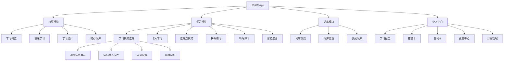
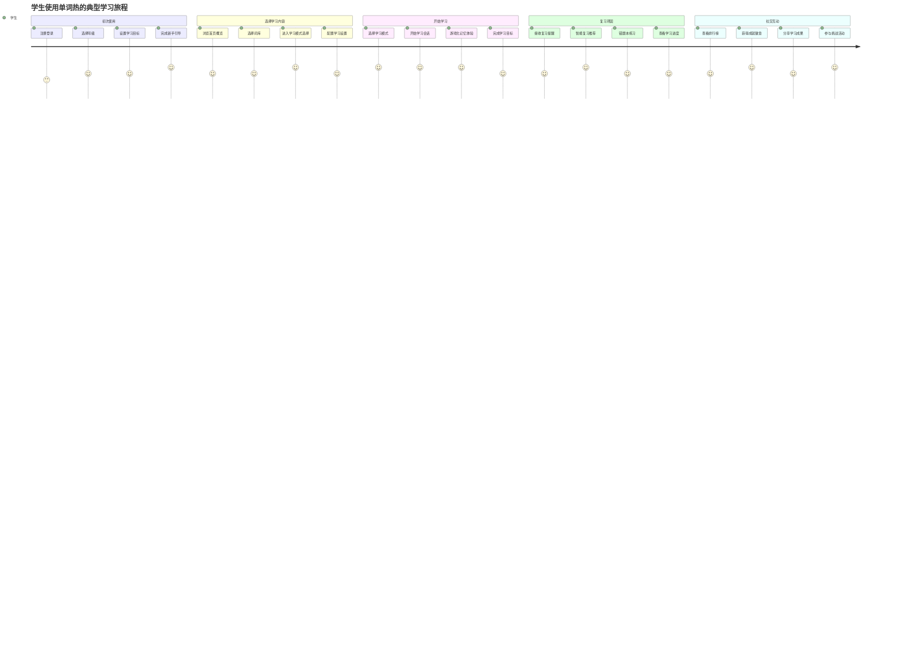
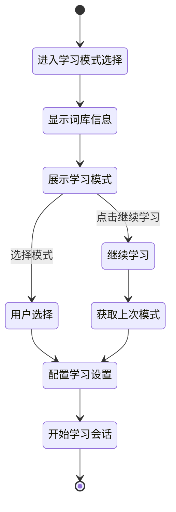
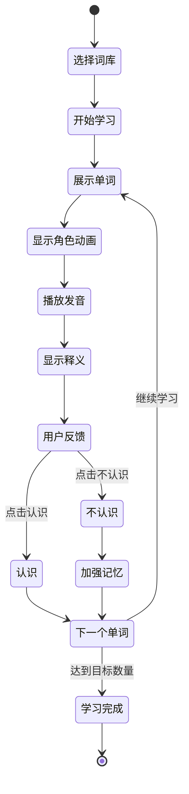

# 单词热 - 产品需求文档 (PRD)

## 1. 文档信息

### 1.1 版本历史

| 版本 | 日期       | 修改内容     | 作者     |
| ---- | ---------- | ------------ | -------- |
| v1.0 | 2025-01-27 | 初始版本创建 | 产品经理 |

### 1.2 文档目的

本文档旨在详细描述"单词热"中小学生背单词神器的产品需求，为设计、开发、测试团队提供明确的产品规格说明和开发指导。

### 1.3 相关文档引用

- 产品路线图 (Roadmap.md)
- 用户故事地图 (User_Story_Map.md)
- 产品评估指标框架 (Metrics_Framework.md)

## 2. 产品概述

### 2.1 产品名称与定位

**产品名称**：单词热  
**产品定位**：专为中小学生（6-18 岁）设计的游戏化背单词学习工具，通过图像记忆和科学算法帮助学生高效记忆英语单词。

### 2.2 产品愿景与使命

**愿景**：成为中小学生最喜爱的英语单词学习伙伴，让背单词变得有趣、高效、持久。  
**使命**：通过游戏化学习和科学记忆方法，帮助中小学生轻松掌握英语词汇，提升英语学习兴趣和成绩。

### 2.3 价值主张与独特卖点(USP)

- **游戏化图像记忆**：独创的游戏形象与单词关联记忆法，让抽象单词变得生动有趣
- **科学记忆算法**：基于艾宾浩斯遗忘曲线的智能复习系统，最大化记忆效果
- **全龄段覆盖**：从小学到高中全学段词汇库，满足不同年级学习需求
- **多维度学习**：结合视觉、听觉、触觉的多感官学习体验

### 2.4 目标平台列表

**第一阶段（MVP）**：

- 微信小程序（主要平台）

**第二阶段**：

- iOS App
- Android App

**第三阶段**：

- Web 网页版
- iPad 适配版

### 2.5 产品核心假设

1. 中小学生更容易被游戏化、视觉化的学习方式吸引
2. 科学的记忆算法能显著提升单词记忆效率
3. 社交化的学习激励机制能提高用户粘性
4. 家长愿意为孩子的英语学习付费

### 2.6 商业模式概述

#### 2.6.1 收入模式

**主要收入来源**：

- **订阅制会员服务**（月度/年度）- 核心收入来源
- **高级功能解锁** - 单次付费解锁特定功能
- **个性化学习报告** - 深度数据分析服务
- **教材同步词库** - 与学校教材配套的专业词库

#### 2.6.2 功能分层策略

**基础功能（免费）**：

- 用户注册和基础设置
- 基础词库（每个年级 100 个核心词汇）
- 卡片模式学习（每日限制 20 个单词）
- 选择题模式测试（每日限制 10 题）
- 基础学习进度跟踪
- 简单的复习提醒
- 基础学习统计（总学习天数、总学习单词数）

**高级功能（会员专享）**：

- **完整词库访问**：全学段词汇库（小学 1200+、初中 2000+、高中 3500+）
- **多种学习模式**：
  - 拼写模式：键盘输入拼写练习
  - 听写模式：听音频写单词
  - 智能混合模式：AI 适应性学习
- **无限制学习**：取消每日学习数量限制
- **高级记忆算法**：完整艾宾浩斯遗忘曲线实现
- **个性化学习报告**：详细的学习数据分析和建议
- **社交功能**：好友系统、排行榜、成就分享
- **离线学习**：支持无网络环境下学习
- **多设备同步**：学习进度云端同步
- **专属客服**：优先技术支持和学习指导

**超级会员功能**：

- **AI 学习助手**：个性化学习路径规划
- **语音识别评测**：发音准确度评估
- **家长监督面板**：详细的学习报告和进度监控
- **教材同步词库**：与主流教材完全同步的专业词库
- **学习效果预测**：基于 AI 的学习成果预测

#### 2.6.3 词库来源与构建

**词库来源**：

1. **官方教材词库**：

   - 人教版、外研版、牛津版等主流教材词汇
   - 与教育部课程标准完全对应
   - 定期更新以适应教材变化

2. **考试专项词库**：

   - 小升初必备词汇
   - 中考高频词汇
   - 高考核心词汇
   - 四六级预备词汇

3. **分级阅读词库**：

   - 按照 CEFR 标准分级
   - 牛津阅读树配套词汇
   - 分级读物高频词汇

4. **专题词库**：
   - 日常生活主题词汇
   - 学科专业词汇
   - 兴趣爱好词汇

**词库质量保证**：

- 专业教研团队审核
- 真人发音录制
- 权威词典释义
- 例句情境化设计
- 定期内容更新

#### 2.6.4 定价策略

**会员定价**：

- **月度会员**：¥19.9/月
- **季度会员**：¥49.9/季（优惠 17%）
- **年度会员**：¥159.9/年（优惠 33%）
- **超级会员**：¥299.9/年

**单项付费**：

- 专项词库解锁：¥9.9-29.9/套
- 个性化学习报告：¥19.9/份
- 高级功能体验包：¥39.9/月

**优惠策略**：

- 新用户首月 1 元体验
- 学生认证享受教育优惠（8 折）
- 推荐好友双方获得会员时长
- 节假日限时优惠活动

## 3. 用户研究

### 3.1 目标用户画像

#### 3.1.1 人口统计特征

**主要用户**：中小学生（6-18 岁）

- 小学生（6-12 岁）：占比 40%
- 初中生（13-15 岁）：占比 35%
- 高中生（16-18 岁）：占比 25%

**决策用户**：家长（25-45 岁）

- 主要为孩子选择和付费的决策者
- 关注孩子学习效果和进度

#### 3.1.2 行为习惯与偏好

- **学习时间**：放学后、周末、假期
- **使用设备**：手机为主，平板为辅
- **学习时长**：单次 15-30 分钟，每日累计 30-60 分钟
- **偏好特点**：喜欢游戏化、视觉化内容，注意力集中时间相对较短

#### 3.1.3 核心需求与痛点

**核心需求**：

- 快速有效地记忆英语单词
- 提升英语考试成绩
- 培养英语学习兴趣

**主要痛点**：

- 传统背单词方式枯燥乏味
- 记忆效果差，容易遗忘
- 缺乏学习动力和持续性
- 不知道如何科学安排复习

#### 3.1.4 动机与目标

- **内在动机**：获得成就感、满足好奇心、享受游戏乐趣
- **外在动机**：提高考试成绩、获得家长老师认可
- **学习目标**：掌握教材词汇、通过各类英语考试、提升英语综合能力

### 3.2 用户场景分析

#### 3.2.1 核心使用场景详述

**场景 1：课后复习巩固**

- 时间：放学后 17:00-19:00
- 地点：家中
- 需求：复习当天学过的单词，巩固记忆
- 使用时长：20-30 分钟

**场景 2：考试备考冲刺**

- 时间：考试前 1-2 周
- 地点：家中、学校
- 需求：快速掌握考试重点词汇
- 使用时长：30-60 分钟

**场景 3：碎片时间学习**

- 时间：上学路上、课间休息
- 地点：交通工具上、学校
- 需求：利用零散时间学习新单词
- 使用时长：5-15 分钟

#### 3.2.2 边缘使用场景考量

- 家长监督学习场景
- 同学间竞赛学习场景
- 老师布置作业场景

### 3.3 用户调研洞察

基于对现有背单词 app 用户的分析发现：

- 67%的用户希望学习过程更有趣味性 <mcreference link="https://www.100ec.cn/detail--6603883.html" index="5">5</mcreference>
- 用户年龄分布呈现"一高多低"特征，20-29 岁占主导 <mcreference link="https://www.100ec.cn/detail--6603883.html" index="5">5</mcreference>
- 百词斩的年龄分布更均匀，涵盖各学龄段 <mcreference link="https://www.100ec.cn/detail--6603883.html" index="5">5</mcreference>

## 4. 市场与竞品分析

### 4.1 市场规模与增长预测

中国在线教育市场规模持续增长，其中 K12 英语学习市场占重要份额。预计 2025 年中小学英语学习 app 市场规模将达到 200 亿元人民币。

### 4.2 行业趋势分析

- **游戏化学习**：越来越多的教育产品采用游戏化设计提升用户参与度
- **AI 个性化**：基于 AI 的个性化学习路径成为主流趋势
- **多感官学习**：结合视觉、听觉、触觉的多维度学习体验
- **家校互通**：家长参与度和监督功能需求增强

### 4.3 竞争格局分析

#### 4.3.1 直接竞争对手详析

**百词斩**

- 优势：图像记忆法成熟、用户基数大、词库丰富 <mcreference link="https://www.woshipm.com/evaluating/4425622.html" index="1">1</mcreference>
- 劣势：过度依赖图片可能影响真实语境理解
- 定位：针对英语考试的单词记忆工具 <mcreference link="https://www.woshipm.com/evaluating/4425622.html" index="1">1</mcreference>
- 特色：视频/电台讲解、多样训练模式 <mcreference link="https://sspai.com/post/43655" index="3">3</mcreference>

**不背单词**

- 优势：真实语境学习、界面简洁、智能算法 <mcreference link="https://www.woshipm.com/evaluating/4425622.html" index="1">1</mcreference>
- 劣势：词库相对较少、部分功能需付费 <mcreference link="https://sspai.com/post/87587" index="2">2</mcreference>
- 定位：真实语境中的科学记忆工具 <mcreference link="https://www.woshipm.com/evaluating/4425622.html" index="1">1</mcreference>

**墨墨背单词**

- 优势：科学的抗遗忘算法、专注度高 <mcreference link="https://www.woshipm.com/evaluating/4425622.html" index="1">1</mcreference>
- 劣势：界面设计相对落后、缺乏趣味性 <mcreference link="https://sspai.com/post/87587" index="2">2</mcreference>
- 定位：基于艾宾浩斯的高效记忆工具

#### 4.3.2 间接竞争对手概述

- 扇贝单词：社区化学习平台
- 沪江开心词场：游戏化背单词 <mcreference link="https://www.xue8nav.com/1340.html" index="2">2</mcreference>
- 知米背单词：高效串联记忆

### 4.4 竞品功能对比矩阵

| 功能特性   | 百词斩 | 不背单词 | 墨墨背单词 | 单词热(规划) |
| ---------- | ------ | -------- | ---------- | ------------ |
| 图像记忆   | ★★★★★  | ★★☆☆☆    | ★★☆☆☆      | ★★★★★        |
| 游戏化设计 | ★★★☆☆  | ★★☆☆☆    | ★★☆☆☆      | ★★★★★        |
| 科学算法   | ★★★☆☆  | ★★★★☆    | ★★★★★      | ★★★★★        |
| 词库丰富度 | ★★★★★  | ★★★☆☆    | ★★★★☆      | ★★★★☆        |
| 界面设计   | ★★★★☆  | ★★★★★    | ★★☆☆☆      | ★★★★★        |
| 中小学适配 | ★★★☆☆  | ★★☆☆☆    | ★★☆☆☆      | ★★★★★        |

#### 4.4.1 图像记忆在应用中的具体体现

**百词斩的图像记忆实现**：

- 每个单词配备专门设计的插画图片
- 图片与单词含义直接关联，形成视觉记忆
- 支持图片遮挡练习，逐步减少图片依赖

**单词热的图像记忆创新**：

- **游戏角色记忆法**：每个单词对应一个独特的游戏角色或场景
  - 例如：`apple` → 苹果树精灵角色，带有苹果元素的动画
  - 例如：`run` → 奔跑的小兔子角色，展示跑步动作
- **动态视觉效果**：
  - 角色具有生动的动画效果（眨眼、移动、互动）
  - 点击角色触发特殊动画和音效
  - 学习进度影响角色外观（等级、装饰、颜色变化）
- **情境化场景设计**：
  - 单词在特定场景中出现（如厨房场景学习食物类单词）
  - 场景与单词主题高度匹配，增强记忆关联
- **收集养成系统**：
  - 用户可以收集和养成不同的单词角色
  - 角色等级与单词掌握程度关联
  - 解锁新角色作为学习激励

#### 4.4.2 游戏化设计在应用中的具体体现

**现有产品的游戏化水平**：

- 百词斩：基础的打卡、连击系统
- 不背单词：简单的学习统计和进度条
- 墨墨背单词：专注算法，游戏化元素较少

**单词热的游戏化设计创新**：

**1. 角色养成系统**：

- **单词精灵收集**：每学会一个单词解锁对应精灵角色
- **精灵进化**：随着单词掌握程度提升，精灵外观和能力进化
- **精灵互动**：可以与精灵进行简单互动（喂食、玩耍、对话）
- **精灵图鉴**：完整的精灵收集图鉴，激发收集欲望

**2. 成就徽章系统**：

- **学习里程碑**：连续学习天数、累计学习单词数等
- **技能徽章**：拼写大师、听力专家、速记达人等专项徽章
- **挑战徽章**：完成特殊挑战获得限定徽章
- **社交徽章**：帮助好友、分享学习等社交行为奖励

**3. 等级排行系统**：

- **个人等级**：基于学习活跃度和掌握程度的综合等级
- **好友排行榜**：与好友比较学习进度和成就
- **全服排行榜**：周榜、月榜激发竞争意识
- **班级排行**：针对学校用户的班级内排名

**4. 任务挑战系统**：

- **每日任务**：学习指定数量单词、完成复习等
- **周度挑战**：主题学习挑战（如动物主题周）
- **限时活动**：节日特别活动、学期挑战赛
- **好友对战**：与好友进行单词 PK，增加社交乐趣

#### 4.4.3 科学算法在应用中的具体体现

**墨墨背单词的算法优势**：

- 严格按照艾宾浩斯遗忘曲线安排复习
- 根据用户反馈调整记忆参数
- 专注算法效果，用户记忆保持率高

**单词热的科学算法创新**：

**1. 增强版艾宾浩斯算法**：

```javascript
// 记忆强度计算公式
memoryStrength =
  baseStrength * decayFactor + reviewBonus + accuracyBonus - difficultyPenalty;

// 复习间隔动态调整
nextReviewTime = calculateOptimalInterval(
  memoryStrength,
  userProfile,
  wordDifficulty
);
```

**核心算法特点**：

- **多因子记忆模型**：
  - 基础记忆强度（初始值 1.0）
  - 时间衰减因子（基于遗忘曲线）
  - 复习次数加成（每次复习+0.1 强度）
  - 正确率加成（准确率 ×0.2）
  - 单词难度惩罚（难度系数 ×0.1）

**2. 个性化学习算法**：

- **学习能力评估**：
  - 分析用户学习速度、记忆保持率、错误模式
  - 建立个人学习能力画像
  - 动态调整学习节奏和难度
- **智能推荐系统**：
  - 基于用户历史数据推荐最适合的学习模式
  - 预测用户可能遗忘的单词，提前安排复习
  - 推荐相似难度和主题的新单词

**3. 多维度数据分析**：

- **学习行为分析**：
  - 最佳学习时间段识别
  - 学习习惯模式分析
  - 注意力集中度评估
- **记忆效果预测**：
  - 基于历史数据预测单词遗忘概率
  - 提供学习效果预期和建议
  - 智能调整学习计划

**4. 自适应学习路径**：

- **动态难度调整**：根据实时表现调整后续单词难度
- **学习模式切换**：智能推荐最适合当前状态的学习模式
- **复习优先级排序**：基于遗忘概率和重要性排序复习内容

**算法效果验证**：

- 目标记忆保持率：85%以上（相比传统方法提升 30%）
- 学习效率提升：减少 40%的重复学习时间
- 个性化准确率：推荐内容匹配度达到 90%以上

### 4.5 市场差异化策略

1. **专注中小学市场**：针对 6-18 岁用户群体的专门设计
2. **游戏形象记忆**：创新的游戏角色与单词关联记忆法
3. **多感官学习体验**：视觉、听觉、触觉的综合刺激
4. **家长参与机制**：完善的学习报告和家长监督功能

## 5. 产品功能需求

### 5.1 功能架构与模块划分



### 5.2 核心功能详述

#### 5.2.1 学习模式选择中心

**功能描述**：
作为一名中小学生，我想要在一个统一的页面中选择不同的学习模式，以便根据我的学习需求和偏好选择最适合的学习方式。

**用户价值**：

- 提供清晰的学习模式对比和选择
- 统一的学习入口，降低认知负担
- 个性化的学习设置和配置
- 便于用户根据不同场景选择合适的学习方式

**功能逻辑与规则**：

1. **词库信息展示**：显示当前选择的词库名称、总单词数、学习进度
2. **学习模式卡片**：展示所有可用的学习模式，包括：
   - 卡片模式：图像记忆单词学习
   - 选择题模式：四选一测试理解
   - 拼写模式：键盘输入拼写练习
   - 听写模式：听音频写单词
   - 智能混合：AI 适应性学习
3. **继续学习功能**：快速进入上次学习的模式
4. **学习设置**：每次学习数量、发音语速、自动播放等个性化配置
5. **学习统计**：显示各模式的掌握率和学习进度

**交互要求**：

- 模式卡片采用大卡片设计，易于点击
- 每个模式显示图标、名称、描述、掌握率
- 支持模式预览和说明
- 设置项采用下拉选择和开关控制
- 继续学习按钮突出显示

**数据需求**：

- 词库基础信息（名称、单词数、进度）
- 各学习模式的统计数据（掌握率、学习次数）
- 用户学习偏好设置
- 上次学习模式记录

**技术依赖**：

- 本地存储用户设置
- 学习数据统计分析
- 页面路由跳转

**验收标准**：

- 所有学习模式正确展示和跳转
- 学习设置保存和应用正常
- 继续学习功能准确记录上次模式
- 统计数据实时更新显示

#### 5.2.2 游戏化单词学习

**功能描述**：
作为一名中小学生，我想要通过有趣的游戏形象来学习单词，以便能够更容易记住和理解单词含义。

**用户价值**：

- 提升学习兴趣和参与度
- 通过视觉联想加强记忆效果
- 降低学习压力，增加学习乐趣

**功能逻辑与规则**：

1. 每个单词匹配一个独特的游戏角色或场景
2. 角色设计与单词含义相关联（如：apple 配苹果树精灵）
3. 学习过程中展示角色动画和互动效果
4. 用户可以收集和养成不同的单词角色
5. 角色等级与单词掌握程度关联

**交互要求**：

- 点击单词显示对应角色动画
- 支持角色互动（点击、拖拽等）
- 流畅的动画过渡效果
- 适合触屏操作的界面设计

**数据需求**：

- 单词基础信息（拼写、发音、释义）
- 角色设计资源（图片、动画、音效）
- 用户学习进度数据
- 角色收集和等级数据

**技术依赖**：

- 动画渲染引擎
- 音频播放功能
- 本地存储能力

**验收标准**：

- 每个单词都有对应的游戏角色
- 角色动画播放流畅，无卡顿
- 用户能够正确理解角色与单词的关联
- 角色收集功能正常运作

#### 5.2.3 智能记忆算法

**功能描述**：
作为一名学生，我想要系统能够根据我的记忆情况智能安排复习，以便能够在最佳时机巩固记忆，提高学习效率。

**用户价值**：

- 科学安排复习时间，最大化记忆效果
- 减少无效重复，提高学习效率
- 个性化学习路径，适应不同学习能力

**功能逻辑与规则**：

1. 基于艾宾浩斯遗忘曲线算法 <mcreference link="https://jiyikapian.cn/" index="3">3</mcreference>
2. 根据用户每次学习反馈调整记忆强度
3. 计算每个单词的遗忘临界点 <mcreference link="https://sj.qq.com/appdetail/com.jizhan.wordapp" index="5">5</mcreference>
4. 智能推送复习提醒
5. 动态调整学习计划和复习频率

**交互要求**：

- 简单的记忆程度反馈按钮（认识/不认识）
- 清晰的复习进度显示
- 智能推送通知

**数据需求**：

- 用户学习历史记录
- 单词记忆强度数据
- 复习时间节点记录
- 遗忘曲线参数

**技术依赖**：

- 算法引擎
- 推送通知服务
- 数据分析能力

**验收标准**：

- 复习推荐准确率达到 85%以上
- 用户记忆保持率提升 30%以上
- 复习提醒及时准确
- 学习计划动态调整正常

#### 5.2.4 多维度测试练习

**功能描述**：
作为一名学生，我想要通过多种形式的测试来检验学习效果，以便全面掌握单词的各个方面。

**用户价值**：

- 全面检验学习效果
- 强化不同维度的记忆
- 及时发现学习薄弱环节

**功能逻辑与规则**：

1. 包含听音辨义、看图选词、拼写填空等多种题型
2. 根据用户水平自动调整题目难度
3. 错题自动加入错词本进行强化练习
4. 测试结果实时反馈和分析
5. 支持限时挑战和无限练习模式

**交互要求**：

- 直观的题目展示界面
- 快速的答案选择操作
- 即时的对错反馈
- 清晰的进度指示

**数据需求**：

- 题库数据（各种题型）
- 用户答题记录
- 错题统计数据
- 测试成绩历史

**技术依赖**：

- 题目生成算法
- 音频播放功能
- 计时器功能

**验收标准**：

- 支持至少 5 种不同题型
- 题目生成准确无误
- 答题响应时间<200ms
- 错题本功能正常运作

#### 5.2.5 社交激励系统

**功能描述**：
作为一名学生，我想要与同学朋友比较学习进度并获得成就认可，以便保持学习动力和积极性。

**用户价值**：

- 增强学习动力和持续性
- 培养良性竞争意识
- 获得成就感和社会认可

**功能逻辑与规则**：

1. 好友排行榜显示学习进度对比
2. 成就徽章系统记录学习里程碑
3. 学习小组功能支持团队学习
4. 每日/每周学习挑战活动
5. 学习成果分享到社交平台

**交互要求**：

- 清晰的排行榜展示
- 精美的徽章设计
- 便捷的分享功能
- 友好的社交互动界面

**数据需求**：

- 用户学习统计数据
- 好友关系数据
- 成就和徽章数据
- 排行榜数据

**技术依赖**：

- 社交功能 API
- 分享功能接口
- 实时数据同步

**验收标准**：

- 排行榜数据实时更新
- 成就徽章正确解锁
- 分享功能正常运作
- 社交互动响应及时

### 5.3 次要功能描述

#### 5.3.1 家长监督功能

- 学习报告生成
- 进度监控面板
- 学习时间管理
- 成绩分析统计

#### 5.3.2 个性化设置

- 学习目标设定
- 提醒时间自定义
- 界面主题选择
- 音效开关控制

#### 5.3.3 离线学习支持

- 词库离线下载
- 离线学习模式
- 数据同步功能

### 5.4 未来功能储备 (Backlog)

- AI 语音评测功能
- 单词拍照识别
- VR/AR 学习体验
- 多语言支持扩展
- 教师端管理系统

## 6. 用户流程与交互设计指导

### 6.1 核心用户旅程地图



### 6.2 关键流程详述与状态转换图

**学习模式选择流程**：



**新词学习流程**：



### 6.3 对设计师 (UI/UX Agent) 的界面原型参考说明和要求

**学习模式选择页面设计要求**：

1. **页面布局**：

   - 顶部导航栏：返回按钮 + 页面标题 + 设置按钮
   - 词库信息卡片：突出显示当前词库、学习进度
   - 学习模式区域：大卡片网格布局，每行 2 个卡片
   - 学习设置区域：折叠式设计，默认收起

2. **视觉层次**：

   - 继续学习按钮：主要 CTA 按钮，使用品牌色
   - 学习模式卡片：清晰的图标 + 标题 + 描述 + 进度
   - 掌握率显示：使用进度条或百分比，颜色编码
   - 设置项：简洁的表单控件

3. **交互反馈**：

   - 卡片点击：轻微缩放动画
   - 模式选择：高亮边框或背景色变化
   - 加载状态：骨架屏或加载动画
   - 成功反馈：Toast 提示或页面跳转动画

4. **响应式设计**：
   - 适配不同屏幕尺寸
   - 卡片布局自适应
   - 字体大小分级

**菜单栏学习入口设计要求**：

1. **图标设计**：

   - 使用直观的学习相关图标
   - 保持与其他菜单项的视觉一致性
   - 支持选中和未选中状态

2. **标签文案**：

   - 简洁明了："学习"
   - 与页面功能匹配

3. **状态指示**：
   - 当前页面高亮显示
   - 学习进度小红点提示（可选）

### 6.4 交互设计规范与原则建议

**交互规范**：

1. **反馈及时**：所有操作都要有即时反馈
2. **容错性强**：支持撤销操作，防止误操作
3. **一致性**：相同功能的交互方式保持一致
4. **可访问性**：支持不同能力用户的使用需求

### 6.5 底部菜单栏（tabBar）统一规范

为保证高保真交互一致性，底部菜单栏统一为 4 栏，分别为：

- 首页（Home）：展示用户概览、快速入口与学习统计
- 学习（Learning）：学习启动页与功能入口
- 词库（Word Library）：词库选择与管理
- 我的（Profile）：个人信息、订阅、设置

使用规范：

- 仅上述四个一级页面出现在底部菜单栏；其他功能页（如练习中心、拼写练习、听写练习、选择题、设置、订阅等）通过页面内按钮或链接跳转，不占用底部菜单。
- 菜单栏跳转使用 wx.switchTab；从菜单栏页面进入非菜单栏页面统一使用 wx.navigateTo；返回采用 wx.navigateBack 或页面内返回按钮。
- 视觉色值统一：未选中颜色 #65728c；选中颜色 #6D28D9（主色）；背景色 #ffffff。

文档与原型需统一展示上述 4 栏结构；已删除的菜单项一律改为链接跳转说明。

### 6.6 关键页面原型与线框

为便于设计与开发快速对齐，补充核心页面的低保真线框与关键元素说明。以下线框为结构参考，视觉细节由 UI 规范统一。

**首页（Home）**

```
[顶部导航]
┌──────────────────────────────────┐
│ 头像/欢迎语      学习统计      快捷入口 │
└──────────────────────────────────┘

[学习概览卡]
┌───────────┬───────────┬───────────┐
│ 今日学习  │ 连续天数  │ 掌握率    │
└───────────┴───────────┴───────────┘

[推荐词库]  [继续学习CTA]
```

- 关键元素：`学习概览卡`、`推荐词库列表`、`继续学习按钮`。
- 交互要点：继续学习固定主色 CTA；推荐词库横向滑动；概览卡点击进入详情。

**学习（Learning）- 学习模式选择页**

```
[顶部导航: 返回 | 学习模式 | 设置]

[词库信息卡]
┌──────────────────────────────┐
│ 词库名称  进度条  已掌握/总数 │
└──────────────────────────────┘

[模式卡片网格]
┌──────────┬──────────┐
│ 卡片学习  │ 选择题   │
├──────────┼──────────┤
│ 拼写练习  │ 听写练习 │
├──────────┼──────────┤
│ 智能混合  │          │
└──────────┴──────────┘

[继续学习 CTA]
[折叠的学习设置]
```

- 关键元素：`模式卡片`（图标+标题+描述+掌握率）、`学习设置`（数量/语速/自动播放）。
- 交互要点：卡片点击缩放反馈；模式预览弹层；设置持久化。

**卡片学习页（图像记忆）**

```
[顶部进度条]
┌───────────────────────────┐
│ 10/20  用时  掌握率         │
└───────────────────────────┘

[单词卡片]
┌───────────────────────────┐
│ 角色动画区（可交互）        │
│ 发音按钮  释义  例句         │
│ 认识/不认识  加强记忆        │
└───────────────────────────┘

[底部操作栏]
  播放/暂停  下一张  收藏/生词本
```

- 关键元素：`角色动画区`、`发音/释义/例句`、`认识/不认识`反馈。
- 状态说明：未学习/学习中/已掌握；动画播放/暂停；加强记忆触发二次练习。

**选择题测试页**

```
[题干区域]
┌───────────────────────────┐
│ 听音/看图/释义 → 选词      │
└───────────────────────────┘

[选项区域]
┌──────────┬──────────┐
│ 选项A     │ 选项B     │
├──────────┼──────────┤
│ 选项C     │ 选项D     │
└──────────┴──────────┘

[反馈与解析]
 正确/错误提示 + 简短解析 + 发音重播

[底部计时/进度]
```

- 关键元素：`题型切换`（看图/听音/释义）、`即时反馈`、`错题加入错词本`。

**拼写/听写练习页**

```
[提示区域]  发音按钮 / 图片提示 / 释义
[输入框]    键盘输入（自动纠错/高亮错误）
[反馈区]    正确拼写 + 例句 + 继续按钮
```

- 关键元素：`输入纠错`、`发音复读`、`例句强化`。

**词库浏览与详情页**

```
[筛选条] 年级/教材/难度/主题
[列表]  单词项（发音 | 释义 | 掌握度 | 收藏）
[详情抽屉/页]  角色预览 | 例句 | 相关练习入口
```

- 关键元素：`筛选`、`掌握度展示`、`练习入口`。

**我的（Profile）/ 成就与排行榜**

```
[个人信息卡]  等级/活跃度/本周学习
[成就徽章墙]  已解锁/未解锁/条件说明
[好友/全服榜]  周榜/月榜 切换
```

- 关键元素：`徽章详情`、`排行榜切换`、`分享入口`。

**家长监督面板（概览）**

```
[孩子学习概览]  学习时长/掌握率/趋势图
[学习报告]      最近7日详单/错词分布/建议
[控制项]        学习目标/提醒时间/屏蔽时段
```

- 关键元素：`趋势图`、`错词分布`、`家长控制项`。

#### 6.6.1 组件清单与状态规范（摘要）

- `词库信息卡`：名称/总数/掌握率/进度条；状态：正常/加载/错误。
- `模式卡片`：图标/标题/描述/掌握率；交互：悬停高亮/点击缩放。
- `单词卡片组件`：角色动画/发音/释义/例句/反馈按钮；状态：未学/学习中/已掌握。
- `反馈控件`：认识/不认识/加强记忆；结果写入学习记录。
- `计时与进度`：学习时长/题目进度/正确率；弱网降级：仅显示基础数字。

#### 6.6.2 原型交付要求

- 原型工具：Figma；页面命名遵循模块-页面-版本规范（如 `Learning-ModeSelect-v1`）。
- 交付内容：页面流转图、线框页、交互标注（Hover/Active/Loading/Empty/Error）。
- 资源占位：角色动画用占位图（1920x1080/2x），发音按钮采用通用图标占位。
- 无障碍标注：按钮命名、可触达区域、对比度提示。

### 6.7 高保真交互原型规范（Hi-Fi）

#### 6.7.1 Design Tokens（设计系统）

- 颜色（Brand & Semantic）：
  - 主色：`#6D28D9`（紫，品牌主色）
  - 次色：`#3B82F6`（信息/强调），`#10B981`（成功），`#F59E0B`（警告），`#EF4444`（错误）
  - 中性色板（文本/边框/背景）：`#111827`、`#1F2937`、`#374151`、`#6B7280`、`#9CA3AF`、`#D1D5DB`、`#E5E7EB`、`#F3F4F6`、`#FAFAFA`、`#FFFFFF`
  - 交互状态色：主色 Hover `#7C3AED`，Active `#5B21B6`，Disabled `#C4B5FD`
- 字体与排版：
  - 中文主字体：`System-UI / PingFang SC / Noto Sans SC`；英文：`Inter`
  - 字号层级：`H1 24/32`，`H2 20/28`，`H3 18/26`，`Body 16/24`，`Caption 14/20`，`Micro 12/18`
  - 字重：`Regular 400`、`Medium 500`、`Semibold 600`
- 间距与栅格：
  - 间距基线：`8pt` 系统（`4/8/12/16/24/32/48`）
  - 容器与安全区：移动端基准宽 `375`；左右内边距 `16`；组件圆角 `12`
  - 列栅格：`12 列`（移动端主要采用 `2/3 列`卡片网格）
- 阴影与层级：
  - 阴影层级：`xs 0,1,2` / `sm 0,2,4` / `md 0,4,8` / `lg 0,8,16`（模糊半径）
  - 层级：`Toast 1000`、`Modal 900`、`Nav 800`、`Sheet 700`
- 交互控件通用规范：
  - 可触达区域：最小 `44x44`；点击反馈 100ms 内可见
  - 焦点可见性：键盘导航显示 `2px` 可见焦点圈，颜色 `#6D28D9`

#### 6.7.2 组件样式与状态（关键组件）

- Button（Primary/Secondary/Tertiary）：
  - Primary：背景 `#6D28D9`，文本 `#FFFFFF`；Hover `#7C3AED`；Pressed `#5B21B6`；Disabled 背景 `#C4B5FD` 文本 `#F8FAFC`
  - Secondary：边框 `#6D28D9`，文本 `#6D28D9`，背景 `#FFFFFF`；Hover 背景 `#F3F4F6`
  - Tertiary（Ghost）：文本 `#374151`，Hover 文本 `#111827`
- Card（信息卡/模式卡）：
  - 背景 `#FFFFFF`，圆角 `12`，阴影 `md`；选中态增加边框 `#6D28D9` `2px`
  - 交互：悬停缩放 `1.02`，按压缩放 `0.98`
- Progress Bar：
  - 轨道 `#E5E7EB`，进度 `#6D28D9`；动画更新时长 `300ms`，缓动 `ease-out`
- Tabs（顶部/分段控制）：
  - 选中：文本 `#111827`，指示线 `#6D28D9`；未选中：文本 `#6B7280`
- List Item（词库项）：
  - 行高 `64`，左侧发音按钮，右侧掌握度标签；滑动操作：收藏/加入生词本
- Input（拼写/听写）：
  - 边框 `#D1D5DB`；聚焦边框 `#6D28D9`；错误边框 `#EF4444`；实时高亮错误字符
- Switch/Checkbox：
  - 开 `#6D28D9`；关 `#9CA3AF`；可触达 44x28，拇指 20
- Toast：
  - 成功背景 `#10B981` 文本白；错误背景 `#EF4444`
- Modal/Sheet：
  - 遮罩 `rgba(17,24,39,0.5)`；弹层圆角 `16`；进入/退出动画 `240ms`
- Badge（成就徽章）：
  - 形状统一，状态色随成就等级变化；支持锁定/解锁视觉态
- Skeleton（加载骨架）：
  - 灰度条 `#E5E7EB`，闪动时长 `1200ms`，线性渐变

#### 6.7.3 页面级高保真规范（关键页面）

- 首页（Home）：
  - 顶部导航高度 `56`；学习概览卡 3 列栅格间距 `12`；CTA 主色按钮宽度自适应，最小宽 `160`
  - 推荐词库水平滑动，滑动指示点主色；空状态展示引导插画
- 学习模式选择（Learning）：
  - 词库信息卡：进度条高度 `8`，圆角 `8`；模式卡片两列网格，卡片最小宽 `160` 高 `120`
  - 折叠设置区域：初始收起；展开动效 `240ms`，`ease-in-out`
  - 继续学习 CTA 固定底部安全区，阴影 `lg`
- 卡片学习（图像记忆）：
  - 角色动画区域高度 `40vh`；发音按钮主色；认识/不认识/加强记忆为 Segmented 控件，间距 `12`
  - 正确反馈：卡片边框闪烁主色 `2x`；错误反馈：摇动 `10deg` 交互动画
  - 空网络/弱网：降级仅文本+发音；动画占位 Skeleton
- 选择题测试：
  - 选项卡片高度 `64`；点击后即时颜色反馈（正确绿、错误红），解析区域上滑出现
  - 计时器右上角，暂停后弹出确认 Modal
- 拼写/听写练习：
  - 输入框 1.25 行高；错误字符红底浅色，正确字符主色下划线
  - 发音复读按钮悬浮右下角，圆形主色
- 词库浏览与详情：
  - 筛选条为 Chips 组，可复选；详情抽屉最大高度 `80vh`
  - 掌握度采用环形进度+百分比，点击进入相关练习
- 我的/成就与排行榜：
  - 徽章网格 `3 列`；锁定态灰度+锁图标；解锁态主色光晕
  - 排行榜支持周/月切换 Tab，条目显示名次徽记
- 家长监督面板：
  - 趋势图为折线+柱形双轴，颜色区分学习时长/掌握率
  - 控制项采用 Switch + 时间选择器，具备限制时段提示

#### 6.7.4 动效规范（Micro-Interactions）

- 时间与缓动：
  - 进入/退出：`240ms ease-in-out`；按钮按压：`100ms ease-out`；列表刷新：`300ms spring`
- 反馈与过渡：
  - 成功勾选动画：缩放 `1.1` 回弹；错误震动：左右位移 `8px`×2
  - 页面切换采用淡入淡出+位移 `16px`
- 音频反馈：
  - 正确音效短促清脆；错误音效低频短促；音量默认 `70%`

#### 6.7.5 无障碍与可用性规范

- 对比度：正文与背景对比度 ≥ `4.5:1`；次要文本 ≥ `3:1`
- 文本替代：角色动画与关键图标提供 `aria-label`
- 触达区域：交互控件最小 `44x44`
- 键盘操作：可聚焦顺序与视觉顺序一致；提供明显焦点样式

#### 6.7.6 资源清单与命名规范

- 图标集：`/assets/icons/`，命名 `ic-{name}-{size}`（如 `ic-audio-24`）
- 动画占位：`/assets/animations/`，`anim-{role}-{state}`（如 `anim-apple-idle`）
- 音频资源：`/assets/audio/`，`au-{word}-{type}`（如 `au-apple-pronounce`）
- 图片与插画：`/assets/images/`，`img-{module}-{desc}`（如 `img-home-hero`）
- 尺寸标准：图标 `24/32`，徽章 `80`，插画最大宽 `320`
- 多分辨率：提供 `1x/2x/3x`；WebP/PNG 优先；音频 `aac/mp3` 128kbps

#### 6.7.7 原型文件结构（Figma）

- Pages：`Design System`、`Components`、`Flows`、`Screens`、`Handoff`
- Components：采用变体属性：`size`、`state`、`type`（如 Button: `primary|secondary|ghost`，`default|hover|pressed|disabled`）
- Screens 命名：`Module-Page-v{version}`（如 `Learning-ModeSelect-v1`、`CardLearning-ImageMemory-v1`）
- Flows：为 `MVP/v1.0/v1.5` 分流，连接交互热点并标注动效参数
- Handoff：标注尺寸、间距、颜色、动效与状态；导出资源切片命名遵循以上规范

## 7. 非功能需求

### 7.1 性能需求

- **响应时间**：页面加载时间<2 秒，操作响应时间<200ms
- **并发量**：支持 10 万+用户同时在线学习
- **稳定性**：系统可用性达到 99.9%以上
- **资源使用率**：内存占用<100MB，CPU 使用率<30%

### 7.2 安全需求

- **数据加密**：用户敏感信息采用 AES-256 加密存储
- **认证授权**：支持微信登录，实现安全的身份验证
- **隐私保护**：严格遵守《儿童个人信息网络保护规定》
- **防攻击策略**：实施防 SQL 注入、XSS 攻击等安全措施

### 7.3 可用性与可访问性标准

- **易用性要求**：新用户 5 分钟内能够完成基本操作
- **WCAG 标准**：支持基础的无障碍访问功能
- **多设备适配**：支持手机、平板等不同设备
- **网络适应**：支持弱网环境下的基本功能使用

### 7.4 合规性要求

- 遵守《网络安全法》相关规定
- 符合《儿童个人信息网络保护规定》
- 遵循教育部相关政策要求
- 符合微信小程序平台规范

### 7.5 数据统计与分析需求

**关键埋点事件**：

- 用户注册/登录
- 学习会话开始/结束
- 单词学习完成
- 测试答题记录
- 社交互动行为
- 付费转化行为

**核心指标监控**：

- 日活跃用户数(DAU)
- 学习完成率
- 用户留存率
- 付费转化率

## 8. 技术架构考量

### 8.1 技术栈建议

**前端技术**：

- 微信小程序原生开发框架
- 后期考虑 uni-app 实现多端统一

**后端技术**：

- Node.js + Express 框架
- MongoDB 数据库
- Redis 缓存

**第三方服务**：

- 微信开放平台
- 腾讯云服务
- 语音合成 API

### 8.2 系统集成需求

- 微信登录授权集成
- 支付系统集成（微信支付）
- 推送通知服务集成
- 数据分析平台集成

### 8.3 技术依赖与约束

- 必须符合微信小程序开发规范
- 支持离线数据存储和同步
- 音频文件压缩和流式播放
- 图片资源优化和 CDN 加速

### 8.4 数据模型建议

**核心实体关系**：

- 用户(User) - 学习记录(StudyRecord) - 单词(Word)
- 用户(User) - 成就(Achievement) - 徽章(Badge)
- 单词(Word) - 角色(Character) - 动画(Animation)

## 9. 验收标准汇总

### 9.1 功能验收标准矩阵

| 功能模块   | 验收标准                               | 优先级 |
| ---------- | -------------------------------------- | ------ |
| 游戏化学习 | 角色动画流畅播放，用户理解度>90%       | P0     |
| 智能算法   | 复习推荐准确率>85%，记忆保持率提升>30% | P0     |
| 测试练习   | 支持 5 种题型，响应时间<200ms          | P0     |
| 社交激励   | 排行榜实时更新，成就系统正常运作       | P1     |
| 家长功能   | 学习报告准确生成，数据统计无误         | P1     |

### 9.2 性能验收标准

- 页面加载时间<2 秒
- 操作响应时间<200ms
- 系统可用性>99.9%
- 内存占用<100MB

### 9.3 质量验收标准

- Bug 密度<1 个/千行代码
- 代码覆盖率>80%
- 用户满意度>4.5 分(5 分制)
- 学习效果提升>25%

## 10. 产品成功指标

### 10.1 关键绩效指标 (KPIs) 定义与目标

**用户增长指标**：

- 月活跃用户数(MAU)：目标 100 万+
- 新用户注册率：目标日增长 1000+
- 用户留存率：7 日留存>40%，30 日留存>20%

**学习效果指标**：

- 单词掌握率：目标>80%
- 学习完成率：目标>70%
- 平均学习时长：目标 30 分钟/日

**商业化指标**：

- 付费转化率：目标>15%
- 月度经常性收入(MRR)：目标 500 万+
- 用户生命周期价值(LTV)：目标>200 元

### 10.2 北极星指标定义与选择依据

**北极星指标**：月度有效学习用户数

- 定义：每月至少完成 10 个单词学习且测试正确率>70%的用户数
- 选择依据：直接反映产品核心价值（帮助用户有效学习单词）
- 目标值：50 万用户

### 10.3 指标监测计划

- **监测频率**：核心指标日报，详细分析周报
- **数据来源**：用户行为埋点、业务数据库、第三方分析工具
- **报告对象**：产品团队、管理层、投资方
- **优化机制**：基于数据分析结果进行产品迭代优化

---

**文档状态**：已完成  
**最后更新**：2025-01-27  
**下一步行动**：开始产品路线图制定和用户故事地图创建
