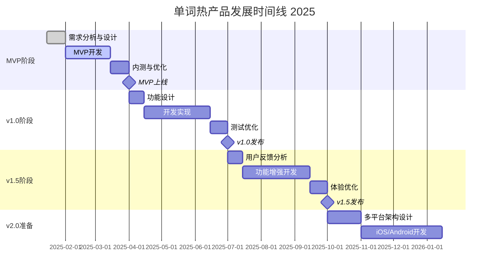

# 单词热 - 产品路线图 (Roadmap)

## 1. 路线图概述

### 1.1 战略目标
通过分阶段的产品迭代，将"单词热"打造成中小学生最受欢迎的背单词学习工具，实现用户规模和商业价值的双重增长。

### 1.2 发展愿景
- **短期目标（6个月）**：建立产品基础功能，获得种子用户认可
- **中期目标（12个月）**：扩大用户规模，完善产品生态
- **长期目标（24个月）**：成为行业领先品牌，实现商业化成功

### 1.3 核心策略
1. **MVP优先**：快速验证核心价值假设
2. **用户驱动**：基于用户反馈持续优化
3. **平台扩展**：从小程序到多平台覆盖
4. **生态建设**：构建完整的学习生态系统

## 2. 版本规划策略

### 2.1 版本命名规则
- **MVP版本**：v0.1 - 最小可行产品
- **正式版本**：v1.0 - 功能完整的首个正式版本
- **迭代版本**：v1.1, v1.2... - 功能增强和优化
- **大版本**：v2.0, v3.0... - 重大功能升级

### 2.2 发布周期
- **MVP阶段**：2周一个迭代
- **正式版本**：4周一个大版本
- **维护更新**：1周一个补丁版本（如需要）

### 2.3 版本质量标准
- 功能完整性：核心功能100%可用
- 性能标准：满足PRD中定义的性能要求
- 用户体验：用户满意度>4.0分
- 稳定性：崩溃率<0.1%

## 3. 详细版本规划

### 3.1 MVP版本 (v0.1) - 核心验证阶段

**时间周期**：2025年2月 - 2025年4月（8周）

**版本目标**：
- 验证游戏化学习的核心价值假设
- 建立基础的用户学习闭环
- 获得初始用户反馈和数据

**核心功能**：
- ✅ 用户注册登录（微信授权）
- ✅ 基础词库（小学/初中/高中各100个核心词汇）
- 🔄 **学习模式选择中心**（当前开发中）
  - 统一的学习模式选择界面
  - 继续学习功能
  - 基础学习设置配置
  - 各模式掌握率统计显示
- ✅ 游戏化单词学习（简化版角色设计）
- ✅ 基础记忆算法（简化版艾宾浩斯曲线）
- ✅ 单词测试（选择题形式）
- ✅ 学习进度跟踪
- ✅ 基础数据统计

**技术实现**：
- 微信小程序原生开发
- 本地数据存储为主
- 基础云服务支持

**成功指标**：
- 注册用户数：1000+
- 日活跃用户：100+
- 用户留存率（7日）：>30%
- 单词学习完成率：>60%

**风险与应对**：
- 风险：用户对游戏化设计接受度不高
- 应对：准备多套角色设计方案，快速A/B测试

### 3.2 正式版本 (v1.0) - 功能完善阶段

**时间周期**：2025年5月 - 2025年7月（12周）

**版本目标**：
- 完善核心功能体验
- 建立完整的学习生态
- 实现基础商业化功能

**新增功能**：
- 🆕 完整词库系统（覆盖小学到高中全部词汇）
- 🆕 多种学习模式完善
  - 拼写模式：键盘输入拼写练习
  - 听写模式：听音频写单词
  - 智能混合模式：AI适应性学习
- 🆕 学习模式个性化配置
  - 自定义学习模式组合
  - 高级学习设置选项
  - 学习偏好记忆
- 🆕 高级记忆算法（完整艾宾浩斯曲线实现）
- 🆕 多样化测试模式（听音辨义、拼写填空等）
- 🆕 社交功能（好友系统、排行榜）
- 🆕 成就系统（徽章、等级）
- 🆕 家长监督功能（学习报告）
- 🆕 会员订阅系统
- 🆕 离线学习支持

**功能优化**：
- 🔄 学习模式选择中心升级
  - 模式预览和说明功能
  - 智能模式推荐
  - 学习路径可视化
- 🔄 游戏角色设计升级（更丰富的动画效果）
- 🔄 界面UI/UX全面优化
- 🔄 性能优化（加载速度、响应时间）
- 🔄 数据分析系统完善

**技术升级**：
- 云端数据同步
- 推送通知系统
- 支付系统集成
- 数据分析平台

**成功指标**：
- 注册用户数：10,000+
- 月活跃用户：3,000+
- 用户留存率（30日）：>20%
- 付费转化率：>10%
- 用户满意度：>4.2分

### 3.3 增强版本 (v1.5) - 体验优化阶段

**时间周期**：2025年8月 - 2025年10月（12周）

**版本目标**：
- 基于用户反馈优化体验
- 扩展学习场景和内容
- 提升用户粘性和付费率

**新增功能**：
- 🆕 AI语音评测（发音练习）
- 🆕 单词拍照识别
- 🆕 学习小组功能
- 🆕 每日挑战活动
- 🆕 个性化学习路径
- 🆕 错词本智能复习
- 🆕 学习数据可视化

**内容扩展**：
- 📚 教材同步词库（人教版、外研版等）
- 📚 考试专项词库（中考、高考）
- 📚 主题词汇包（动物、食物、运动等）
- 📚 短语和句型学习

**功能优化**：
- 🔄 游戏化元素增强（更多角色、场景）
- 🔄 社交功能完善（群组学习、互动）
- 🔄 家长功能升级（详细分析报告）
- 🔄 算法优化（更精准的个性化推荐）

**成功指标**：
- 月活跃用户：15,000+
- 用户留存率（30日）：>25%
- 付费转化率：>15%
- 平均学习时长：>25分钟/日
- NPS净推荐值：>50

### 3.4 平台扩展版本 (v2.0) - 多端布局阶段

**时间周期**：2025年11月 - 2026年2月（16周）

**版本目标**：
- 扩展到iOS和Android平台
- 建立跨平台用户生态
- 实现规模化增长

**平台扩展**：
- 📱 iOS App开发上线
- 📱 Android App开发上线
- 💻 Web网页版（基础功能）
- 🔄 数据跨平台同步

**新增功能**：
- 🆕 VR/AR学习体验（试验性功能）
- 🆕 多语言支持（英语、数学词汇扩展）
- 🆕 教师端管理系统
- 🆕 班级管理功能
- 🆕 学习竞赛系统

**技术架构升级**：
- 统一后端API服务
- 跨平台数据同步
- 性能监控系统
- 安全防护升级

**成功指标**：
- 总注册用户：100,000+
- 月活跃用户：50,000+
- 多平台用户分布均衡
- 付费用户数：7,500+
- 月度收入：500万+

### 3.5 生态完善版本 (v2.5) - 生态建设阶段

**时间周期**：2026年3月 - 2026年6月（16周）

**版本目标**：
- 构建完整学习生态系统
- 实现商业模式多元化
- 建立行业领先地位

**生态功能**：
- 🏫 学校合作版本
- 👨‍🏫 教师培训系统
- 📊 教育数据分析平台
- 🎯 个性化学习方案定制
- 🏆 全国学习竞赛平台

**商业化升级**：
- 💰 企业版订阅服务
- 📚 内容付费商城
- 🎁 周边产品销售
- 🤝 品牌合作推广

**技术创新**：
- 🤖 AI智能学习助手
- 📈 大数据学习分析
- 🔊 语音交互功能
- 🌐 云端协作学习

**成功指标**：
- 总注册用户：500,000+
- 月活跃用户：200,000+
- 付费转化率：>20%
- 年度收入：5000万+
- 市场占有率：行业前三

## 4. 功能优先级矩阵

### 4.1 功能分级标准

**P0级功能（必须有）**：
- 产品核心价值功能
- 用户基本需求功能
- 商业模式关键功能

**P1级功能（应该有）**：
- 用户体验增强功能
- 竞争差异化功能
- 运营支持功能

**P2级功能（可以有）**：
- 锦上添花功能
- 未来扩展功能
- 实验性功能

### 4.2 各版本功能优先级分布

| 功能模块 | MVP(v0.1) | v1.0 | v1.5 | v2.0 | v2.5 |
|----------|-----------|------|------|------|------|
| 用户系统 | P0 | P0 | P1 | P1 | P1 |
| 词库管理 | P0 | P0 | P0 | P0 | P0 |
| 游戏化学习 | P0 | P0 | P0 | P0 | P0 |
| 记忆算法 | P0 | P0 | P0 | P0 | P0 |
| 测试练习 | P0 | P0 | P0 | P0 | P0 |
| 社交功能 | - | P1 | P0 | P0 | P0 |
| 家长功能 | - | P1 | P1 | P1 | P0 |
| 付费系统 | - | P0 | P0 | P0 | P0 |
| AI功能 | - | - | P1 | P0 | P0 |
| 多平台支持 | - | - | - | P0 | P0 |
| 教师端 | - | - | - | P1 | P0 |
| 生态功能 | - | - | - | - | P0 |

## 5. 详细时间线计划

### 5.1 2025年发展时间线

### 5.2 关键里程碑节点

| 里程碑 | 时间节点 | 关键成果 | 成功标准 |
|--------|----------|----------|----------|
| MVP上线 | 2025-04-01 | 核心功能验证 | 1000+注册用户 |
| v1.0发布 | 2025-07-01 | 完整产品体验 | 10,000+用户，10%付费率 |
| v1.5发布 | 2025-10-01 | 体验优化完成 | 15,000+MAU，15%付费率 |
| 多平台上线 | 2026-02-01 | 平台扩展完成 | 100,000+总用户 |
| 生态建设 | 2026-06-01 | 完整生态体系 | 500,000+用户，行业前三 |

### 5.3 季度目标分解

**2025 Q1目标**：
- 完成MVP开发和上线
- 获得1000+种子用户
- 验证核心价值假设

**2025 Q2目标**：
- 发布v1.0正式版本
- 实现10,000+注册用户
- 建立基础商业化模式

**2025 Q3目标**：
- 优化用户体验至v1.5
- 达到15,000+月活用户
- 付费转化率提升至15%

**2025 Q4目标**：
- 启动多平台开发
- 准备iOS/Android版本
- 建立技术架构基础

## 6. 资源规划

### 6.1 团队配置建议

**MVP阶段团队（6人）**：
- 产品经理：1人
- UI/UX设计师：1人
- 前端开发工程师：2人
- 后端开发工程师：1人
- 测试工程师：1人

**v1.0阶段团队（10人）**：
- 产品经理：1人
- UI/UX设计师：2人
- 前端开发工程师：3人
- 后端开发工程师：2人
- 测试工程师：1人
- 运营专员：1人

**v2.0阶段团队（15人）**：
- 产品经理：2人
- 设计师：3人
- 开发工程师：6人
- 测试工程师：2人
- 运营团队：2人

### 6.2 预算规划

**MVP阶段预算（3个月）**：
- 人力成本：60万元
- 技术服务：10万元
- 运营推广：20万元
- 总计：90万元

**v1.0阶段预算（6个月）**：
- 人力成本：150万元
- 技术服务：30万元
- 运营推广：100万元
- 总计：280万元

**全年预算（2025年）**：
- 人力成本：400万元
- 技术服务：80万元
- 运营推广：300万元
- 其他费用：120万元
- 总计：900万元

### 6.3 技术资源需求

**基础设施**：
- 云服务器（腾讯云/阿里云）
- CDN加速服务
- 数据库服务（MongoDB/Redis）
- 对象存储服务

**第三方服务**：
- 微信开放平台
- 支付服务接口
- 推送通知服务
- 数据分析平台
- 语音合成API

**开发工具**：
- 代码管理（Git）
- 项目管理（Jira/Trello）
- 设计工具（Figma/Sketch）
- 测试工具（自动化测试框架）

## 7. 风险管理

### 7.1 技术风险

**风险识别**：
- 微信小程序政策变化风险
- 技术架构扩展性风险
- 第三方服务依赖风险
- 数据安全和隐私风险

**应对策略**：
- 密切关注平台政策变化，准备多平台备选方案
- 采用模块化架构设计，确保系统可扩展性
- 建立多个第三方服务备选方案
- 严格遵循数据保护法规，建立安全防护体系

### 7.2 市场风险

**风险识别**：
- 竞争对手快速跟进风险
- 用户需求变化风险
- 教育政策变化风险
- 市场饱和风险

**应对策略**：
- 建立技术和内容护城河
- 建立用户反馈机制，快速响应需求变化
- 关注教育政策动向，及时调整产品策略
- 差异化定位，避免同质化竞争

### 7.3 商业风险

**风险识别**：
- 用户付费意愿不足风险
- 获客成本过高风险
- 现金流断裂风险
- 商业模式验证失败风险

**应对策略**：
- 多元化商业模式，降低单一收入依赖
- 优化运营效率，控制获客成本
- 合理规划资金使用，确保现金流健康
- 快速试错，及时调整商业策略

### 7.4 运营风险

**风险识别**：
- 用户流失率过高风险
- 内容质量控制风险
- 客服支持不足风险
- 品牌形象受损风险

**应对策略**：
- 建立用户留存分析体系，及时发现问题
- 建立内容审核和质量控制流程
- 建立完善的客服支持体系
- 建立品牌监控和危机公关机制

## 8. 成功评估标准

### 8.1 各阶段成功标准

**MVP阶段成功标准**：
- ✅ 产品功能完整可用
- ✅ 用户反馈积极（满意度>4.0）
- ✅ 核心指标达成（1000+用户，30%留存）
- ✅ 技术架构稳定可扩展

**v1.0阶段成功标准**：
- ✅ 功能体验完善
- ✅ 商业化模式验证成功
- ✅ 用户规模达标（10,000+用户）
- ✅ 团队协作高效

**v2.0阶段成功标准**：
- ✅ 多平台成功扩展
- ✅ 用户规模突破（100,000+用户）
- ✅ 收入目标达成（500万+/月）
- ✅ 市场地位确立

### 8.2 关键决策节点

**MVP评估节点（2025年4月）**：
- 决策：是否继续投入开发v1.0
- 标准：用户反馈积极，核心指标达成

**v1.0评估节点（2025年7月）**：
- 决策：是否加大投入进行平台扩展
- 标准：商业化验证成功，用户增长健康

**v2.0评估节点（2026年2月）**：
- 决策：是否进行大规模市场推广
- 标准：多平台表现良好，收入增长稳定

### 8.3 调整机制

**定期评估**：
- 月度数据回顾和分析
- 季度战略调整会议
- 半年度路线图更新

**应急调整**：
- 重大市场变化响应机制
- 技术风险应急预案
- 竞争对手动态应对策略

---

**文档状态**：已完成  
**最后更新**：2025-01-27  
**下一步行动**：创建用户故事地图，细化功能需求