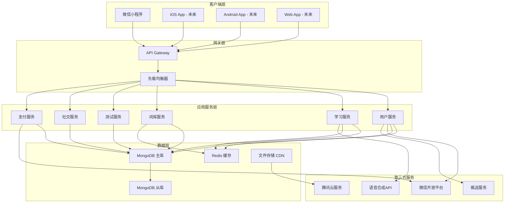
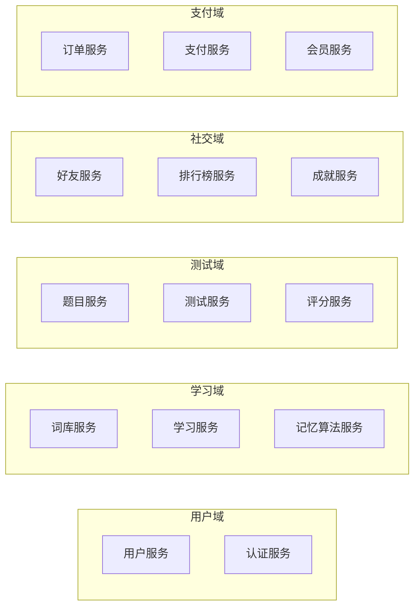

# 单词热 - 产品技术规格说明书 (Technical Specification)

## 1. 文档信息

### 1.1 版本历史
| 版本 | 日期 | 修改内容 | 作者 |
|------|------|----------|------|
| v1.0 | 2025-01-27 | 初始版本创建 | 技术架构师 |

### 1.2 文档目的
本文档基于《单词热 - 产品需求文档 (PRD)》和《单词热 - 用户故事地图 (User Story Map)》，详细描述"单词热"中小学生背单词神器的技术架构设计、系统实现方案和开发规范，为开发团队提供完整的技术实施指导。

### 1.3 相关文档引用
- 产品需求文档 (PRD.md)
- 用户故事地图 (User_Story_Map.md)
- 产品路线图 (Roadmap.md)
- 产品评估指标框架 (Metrics_Framework.md)

## 2. 技术架构概览

### 2.1 整体架构设计



### 2.2 架构设计原则

**可扩展性**：
- 微服务架构，支持独立部署和扩展
- 水平扩展能力，支持高并发访问
- 模块化设计，便于功能迭代

**高可用性**：
- 主从数据库架构，保证数据安全
- Redis缓存提升响应速度
- CDN加速静态资源访问

**安全性**：
- API网关统一鉴权和限流
- 数据加密存储和传输
- 符合儿童隐私保护规范

**性能优化**：
- 缓存策略减少数据库压力
- 异步处理提升用户体验
- 资源压缩和CDN加速

## 3. 技术栈选型

### 3.1 前端技术栈

**微信小程序 (MVP阶段)**：
```javascript
// 技术栈组成
{
  "framework": "微信小程序原生框架",
  "language": "JavaScript ES6+",
  "ui": "WXSS + WXML",
  "state": "小程序原生状态管理",
  "storage": "wx.setStorage / wx.getStorage",
  "network": "wx.request",
  "animation": "wx.createAnimation"
}
```

**跨平台方案 (v2.0阶段)**：
```javascript
// 未来技术栈
{
  "framework": "uni-app",
  "language": "Vue.js 3.0 + TypeScript",
  "ui": "uni-ui组件库",
  "state": "Vuex / Pinia",
  "build": "Vite",
  "testing": "Jest + Vue Test Utils"
}
```

### 3.2 后端技术栈

**核心技术**：
```javascript
// 后端技术栈
{
  "runtime": "Node.js 18.x LTS",
  "framework": "Express.js 4.x",
  "language": "JavaScript ES6+ / TypeScript",
  "database": "MongoDB 6.x",
  "cache": "Redis 7.x",
  "auth": "JWT + 微信OAuth",
  "validation": "Joi",
  "logging": "Winston",
  "testing": "Jest + Supertest"
}
```

**开发工具**：
```javascript
// 开发环境
{
  "package_manager": "npm / yarn",
  "process_manager": "PM2",
  "api_docs": "Swagger / OpenAPI 3.0",
  "code_quality": "ESLint + Prettier",
  "git_hooks": "Husky + lint-staged"
}
```

### 3.3 基础设施技术栈

**云服务平台**：
```yaml
# 腾讯云服务
cloud_provider: "腾讯云"
services:
  compute: "云服务器 CVM"
  database: "云数据库 MongoDB"
  cache: "云缓存 Redis"
  storage: "对象存储 COS"
  cdn: "内容分发网络 CDN"
  monitoring: "云监控 CM"
  logging: "日志服务 CLS"
```

**DevOps工具链**：
```yaml
# CI/CD 流水线
version_control: "Git + GitHub/GitLab"
ci_cd: "GitHub Actions / GitLab CI"
containerization: "Docker"
orchestration: "Docker Compose"
monitoring: "Prometheus + Grafana"
alerting: "钉钉/企业微信通知"
```

### 3.4 第三方服务集成

**微信生态**：
- 微信小程序开发框架
- 微信登录授权
- 微信支付
- 微信推送通知

**AI服务**：
- 腾讯云语音合成 TTS
- 腾讯云语音识别 ASR
- 百度AI开放平台（备选）

**数据分析**：
- 微信小程序数据助手
- 腾讯移动分析 MTA
- 自建埋点系统

## 4. 系统架构详细设计

### 4.1 微服务架构设计

**服务拆分策略**：



**服务职责定义**：

| 服务名称 | 主要职责 | 技术特点 |
|----------|----------|----------|
| 用户服务 | 用户信息管理、个人设置 | 高并发读写 |
| 认证服务 | 登录认证、权限控制 | 安全性要求高 |
| 词库服务 | 词汇数据管理、分类检索 | 读多写少 |
| 学习服务 | 学习会话管理、进度跟踪 | 实时性要求高 |
| 记忆算法服务 | 遗忘曲线计算、复习推荐 | 计算密集型 |
| 题目服务 | 题目生成、题库管理 | 算法复杂度高 |
| 测试服务 | 测试会话管理、结果统计 | 数据一致性要求高 |
| 社交服务 | 好友关系、互动功能 | 社交网络特性 |
| 支付服务 | 支付流程、订单管理 | 金融级安全要求 |

### 4.2 数据库设计

**MongoDB 集合设计**：

```javascript
// 用户集合 (users)
{
  _id: ObjectId,
  openid: String,           // 微信openid
  unionid: String,          // 微信unionid
  nickname: String,         // 用户昵称
  avatar: String,           // 头像URL
  grade: String,            // 年级 (primary/junior/senior)
  learning_goal: {          // 学习目标
    daily_words: Number,    // 每日单词数
    study_duration: Number  // 学习时长(分钟)
  },
  subscription: {           // 订阅信息
    type: String,           // 订阅类型 (free/monthly/yearly/lifetime)
    expire_date: Date,      // 到期时间
    auto_renew: Boolean     // 自动续费
  },
  statistics: {             // 学习统计
    total_words: Number,    // 总学单词数
    study_days: Number,     // 学习天数
    current_streak: Number  // 连续学习天数
  },
  created_at: Date,
  updated_at: Date
}

// 单词集合 (words)
{
  _id: ObjectId,
  word: String,             // 单词
  phonetic: String,         // 音标
  pronunciation: String,    // 发音文件URL
  definitions: [{           // 释义列表
    part_of_speech: String, // 词性
    meaning: String,        // 中文释义
    example: String         // 例句
  }],
  difficulty: Number,       // 难度等级 (1-5)
  frequency: Number,        // 使用频率
  categories: [String],     // 分类标签
  character: {              // 游戏角色
    name: String,           // 角色名称
    image: String,          // 角色图片
    animation: String       // 动画文件
  },
  created_at: Date
}

// 学习记录集合 (study_records)
{
  _id: ObjectId,
  user_id: ObjectId,        // 用户ID
  word_id: ObjectId,        // 单词ID
  session_id: String,       // 学习会话ID
  memory_strength: Number,  // 记忆强度 (0-1)
  review_count: Number,     // 复习次数
  correct_count: Number,    // 正确次数
  last_review: Date,        // 最后复习时间
  next_review: Date,        // 下次复习时间
  mastery_level: String,    // 掌握程度 (learning/familiar/mastered)
  created_at: Date,
  updated_at: Date
}

// 测试记录集合 (test_records)
{
  _id: ObjectId,
  user_id: ObjectId,        // 用户ID
  test_type: String,        // 测试类型 (quiz/spelling/dictation)
  word_ids: [ObjectId],     // 测试单词列表
  questions: [{             // 题目列表
    word_id: ObjectId,
    question_type: String,  // 题目类型
    user_answer: String,    // 用户答案
    correct_answer: String, // 正确答案
    is_correct: Boolean,    // 是否正确
    response_time: Number   // 响应时间(ms)
  }],
  score: Number,            // 得分
  accuracy: Number,         // 正确率
  duration: Number,         // 测试时长(秒)
  created_at: Date
}

// 成就集合 (achievements)
{
  _id: ObjectId,
  user_id: ObjectId,        // 用户ID
  achievement_type: String, // 成就类型
  title: String,            // 成就标题
  description: String,      // 成就描述
  icon: String,             // 成就图标
  progress: Number,         // 进度值
  target: Number,           // 目标值
  is_completed: Boolean,    // 是否完成
  completed_at: Date,       // 完成时间
  created_at: Date
}
```

**Redis 缓存策略**：

```javascript
// 缓存键设计
const CACHE_KEYS = {
  // 用户相关
  USER_INFO: 'user:info:{user_id}',           // 用户基本信息
  USER_STATS: 'user:stats:{user_id}',         // 用户统计数据
  USER_SESSION: 'user:session:{session_id}',  // 用户会话
  
  // 学习相关
  WORD_DETAIL: 'word:detail:{word_id}',       // 单词详情
  WORD_LIST: 'word:list:{category}:{page}',   // 单词列表
  STUDY_PLAN: 'study:plan:{user_id}',         // 学习计划
  REVIEW_QUEUE: 'review:queue:{user_id}',     // 复习队列
  
  // 社交相关
  LEADERBOARD: 'social:leaderboard:{type}',   // 排行榜
  USER_FRIENDS: 'social:friends:{user_id}',   // 好友列表
  
  // 系统相关
  API_RATE_LIMIT: 'rate:limit:{user_id}',     // API限流
  SYSTEM_CONFIG: 'system:config'              // 系统配置
};

// 缓存过期时间
const CACHE_TTL = {
  USER_INFO: 3600,        // 1小时
  WORD_DETAIL: 86400,     // 24小时
  LEADERBOARD: 300,       // 5分钟
  STUDY_PLAN: 1800,       // 30分钟
  API_RATE_LIMIT: 60      // 1分钟
};
```

### 4.3 API接口设计规范

**RESTful API 设计原则**：

```javascript
// API 基础结构
const API_BASE_URL = 'https://api.dancire.com/v1';

// 统一响应格式
{
  "success": true,          // 请求是否成功
  "code": 200,             // 状态码
  "message": "操作成功",    // 响应消息
  "data": {},              // 响应数据
  "timestamp": 1640995200, // 时间戳
  "request_id": "uuid"     // 请求ID
}

// 错误响应格式
{
  "success": false,
  "code": 400,
  "message": "参数错误",
  "error": {
    "type": "VALIDATION_ERROR",
    "details": [
      {
        "field": "grade",
        "message": "年级参数必填"
      }
    ]
  },
  "timestamp": 1640995200,
  "request_id": "uuid"
}
```

**核心API接口定义**：

```yaml
# 用户相关API
/api/v1/auth:
  POST /login:              # 用户登录
    description: "微信授权登录"
    request:
      code: string          # 微信授权码
    response:
      token: string         # JWT令牌
      user: object          # 用户信息

  POST /logout:             # 用户登出
    description: "退出登录"

/api/v1/users:
  GET /{user_id}:           # 获取用户信息
    description: "获取用户详细信息"
    response:
      user: object          # 用户信息

  PUT /{user_id}:           # 更新用户信息
    description: "更新用户资料"
    request:
      nickname: string      # 昵称
      grade: string         # 年级
      learning_goal: object # 学习目标

  GET /{user_id}/statistics: # 获取学习统计
    description: "获取用户学习数据统计"
    response:
      statistics: object    # 统计数据

# 词库相关API
/api/v1/words:
  GET /:                    # 获取单词列表
    description: "分页获取单词列表"
    query:
      category: string      # 分类
      grade: string         # 年级
      page: number          # 页码
      limit: number         # 每页数量
    response:
      words: array          # 单词列表
      pagination: object    # 分页信息

  GET /{word_id}:           # 获取单词详情
    description: "获取单词详细信息"
    response:
      word: object          # 单词详情

  GET /categories:          # 获取分类列表
    description: "获取词库分类"
    response:
      categories: array     # 分类列表

# 学习相关API
/api/v1/study:
  POST /sessions:           # 开始学习会话
    description: "创建学习会话"
    request:
      word_ids: array       # 单词ID列表
      session_type: string  # 会话类型
    response:
      session_id: string    # 会话ID
      words: array          # 单词列表

  PUT /sessions/{session_id}: # 更新学习进度
    description: "提交学习结果"
    request:
      word_id: string       # 单词ID
      is_known: boolean     # 是否认识
      response_time: number # 响应时间
    response:
      next_word: object     # 下一个单词

  GET /plans/{user_id}:     # 获取学习计划
    description: "获取个人学习计划"
    response:
      plan: object          # 学习计划

  GET /reviews/{user_id}:   # 获取复习列表
    description: "获取待复习单词"
    response:
      words: array          # 待复习单词

# 测试相关API
/api/v1/tests:
  POST /:                   # 创建测试
    description: "创建单词测试"
    request:
      test_type: string     # 测试类型
      word_ids: array       # 单词ID列表
      difficulty: number    # 难度等级
    response:
      test_id: string       # 测试ID
      questions: array      # 题目列表

  PUT /{test_id}/submit:    # 提交测试答案
    description: "提交测试结果"
    request:
      answers: array        # 答案列表
    response:
      score: number         # 得分
      accuracy: number      # 正确率
      analysis: object      # 结果分析

  GET /{test_id}/result:    # 获取测试结果
    description: "获取测试详细结果"
    response:
      result: object        # 测试结果

# 社交相关API
/api/v1/social:
  GET /leaderboard:         # 获取排行榜
    description: "获取学习排行榜"
    query:
      type: string          # 排行榜类型
      period: string        # 时间周期
    response:
      rankings: array       # 排名列表

  POST /friends:            # 添加好友
    description: "添加学习好友"
    request:
      friend_id: string     # 好友ID
    response:
      friendship: object    # 好友关系

  GET /friends/{user_id}:   # 获取好友列表
    description: "获取好友列表"
    response:
      friends: array        # 好友列表

  GET /achievements/{user_id}: # 获取成就列表
    description: "获取用户成就"
    response:
      achievements: array   # 成就列表
```

### 4.4 智能记忆算法设计

**艾宾浩斯遗忘曲线算法实现**：

```javascript
// 记忆强度计算算法
class MemoryAlgorithm {
  constructor() {
    // 遗忘曲线参数
    this.FORGETTING_CURVE = {
      INITIAL_STRENGTH: 1.0,      // 初始记忆强度
      DECAY_RATE: 0.5,            // 衰减率
      REVIEW_BOOST: 0.3,          // 复习提升
      DIFFICULTY_FACTOR: 0.1      // 难度因子
    };
    
    // 复习间隔 (小时)
    this.REVIEW_INTERVALS = [1, 4, 24, 72, 168, 336, 720];
  }

  /**
   * 计算记忆强度
   * @param {Object} record - 学习记录
   * @returns {Number} 记忆强度 (0-1)
   */
  calculateMemoryStrength(record) {
    const now = new Date();
    const lastReview = new Date(record.last_review);
    const hoursPassed = (now - lastReview) / (1000 * 60 * 60);
    
    // 基础遗忘计算
    const decayFactor = Math.exp(-hoursPassed * this.FORGETTING_CURVE.DECAY_RATE);
    
    // 复习次数加成
    const reviewBonus = Math.min(record.review_count * 0.1, 0.5);
    
    // 正确率加成
    const accuracyBonus = (record.correct_count / record.review_count) * 0.2;
    
    // 难度调整
    const difficultyPenalty = record.word.difficulty * this.FORGETTING_CURVE.DIFFICULTY_FACTOR;
    
    const memoryStrength = Math.max(0, Math.min(1, 
      record.memory_strength * decayFactor + reviewBonus + accuracyBonus - difficultyPenalty
    ));
    
    return memoryStrength;
  }

  /**
   * 计算下次复习时间
   * @param {Object} record - 学习记录
   * @returns {Date} 下次复习时间
   */
  calculateNextReview(record) {
    const memoryStrength = this.calculateMemoryStrength(record);
    const reviewLevel = Math.min(record.review_count, this.REVIEW_INTERVALS.length - 1);
    
    // 基础间隔
    let baseInterval = this.REVIEW_INTERVALS[reviewLevel];
    
    // 记忆强度调整
    const strengthMultiplier = memoryStrength > 0.8 ? 1.5 : 
                              memoryStrength > 0.6 ? 1.0 : 0.5;
    
    const adjustedInterval = baseInterval * strengthMultiplier;
    
    const nextReview = new Date();
    nextReview.setHours(nextReview.getHours() + adjustedInterval);
    
    return nextReview;
  }

  /**
   * 获取复习推荐列表
   * @param {String} userId - 用户ID
   * @param {Number} limit - 推荐数量
   * @returns {Array} 推荐复习单词列表
   */
  async getReviewRecommendations(userId, limit = 20) {
    const now = new Date();
    
    // 查询需要复习的单词
    const dueWords = await StudyRecord.find({
      user_id: userId,
      next_review: { $lte: now },
      mastery_level: { $ne: 'mastered' }
    }).populate('word_id').sort({ next_review: 1 });
    
    // 按优先级排序
    const prioritizedWords = dueWords.map(record => {
      const memoryStrength = this.calculateMemoryStrength(record);
      const urgency = (now - record.next_review) / (1000 * 60 * 60); // 超期小时数
      const priority = (1 - memoryStrength) * 0.7 + Math.min(urgency / 24, 1) * 0.3;
      
      return {
        ...record.toObject(),
        priority,
        memory_strength: memoryStrength
      };
    }).sort((a, b) => b.priority - a.priority);
    
    return prioritizedWords.slice(0, limit);
  }
}
```

**个性化学习路径算法**：

```javascript
// 学习路径推荐算法
class LearningPathAlgorithm {
  constructor() {
    this.USER_FACTORS = {
      LEARNING_SPEED: 'learning_speed',     // 学习速度
      RETENTION_RATE: 'retention_rate',     // 记忆保持率
      DIFFICULTY_PREFERENCE: 'difficulty_preference', // 难度偏好
      LEARNING_TIME: 'learning_time'        // 学习时间偏好
    };
  }

  /**
   * 分析用户学习特征
   * @param {String} userId - 用户ID
   * @returns {Object} 用户学习特征
   */
  async analyzeUserProfile(userId) {
    const studyRecords = await StudyRecord.find({ user_id: userId })
      .populate('word_id')
      .sort({ created_at: -1 })
      .limit(100);
    
    if (studyRecords.length === 0) {
      return this.getDefaultProfile();
    }
    
    // 学习速度分析
    const avgLearningTime = studyRecords.reduce((sum, record) => 
      sum + record.response_time, 0) / studyRecords.length;
    const learningSpeed = avgLearningTime < 3000 ? 'fast' : 
                         avgLearningTime < 6000 ? 'medium' : 'slow';
    
    // 记忆保持率分析
    const retentionRate = studyRecords.reduce((sum, record) => 
      sum + (record.correct_count / record.review_count), 0) / studyRecords.length;
    
    // 难度偏好分析
    const avgDifficulty = studyRecords.reduce((sum, record) => 
      sum + record.word_id.difficulty, 0) / studyRecords.length;
    
    // 学习时间偏好分析
    const learningHours = studyRecords.map(record => 
      new Date(record.created_at).getHours());
    const preferredHour = this.getMostFrequentHour(learningHours);
    
    return {
      learning_speed: learningSpeed,
      retention_rate: retentionRate,
      difficulty_preference: avgDifficulty,
      preferred_learning_hour: preferredHour,
      total_words_learned: studyRecords.length
    };
  }

  /**
   * 生成个性化学习计划
   * @param {String} userId - 用户ID
   * @param {Object} userGoals - 用户学习目标
   * @returns {Object} 个性化学习计划
   */
  async generateLearningPlan(userId, userGoals) {
    const userProfile = await this.analyzeUserProfile(userId);
    const user = await User.findById(userId);
    
    // 根据用户特征调整学习参数
    const dailyWordCount = this.calculateOptimalWordCount(userProfile, userGoals);
    const difficultyProgression = this.calculateDifficultyProgression(userProfile);
    const reviewSchedule = this.generateReviewSchedule(userProfile);
    
    // 选择适合的词库
    const recommendedWordbooks = await this.recommendWordbooks(user.grade, userProfile);
    
    return {
      daily_word_count: dailyWordCount,
      difficulty_progression: difficultyProgression,
      review_schedule: reviewSchedule,
      recommended_wordbooks: recommendedWordbooks,
      estimated_completion_time: this.estimateCompletionTime(userGoals, userProfile)
    };
  }

  /**
   * 计算最优单词数量
   * @param {Object} userProfile - 用户特征
   * @param {Object} userGoals - 用户目标
   * @returns {Number} 每日推荐单词数
   */
  calculateOptimalWordCount(userProfile, userGoals) {
    let baseCount = userGoals.daily_words || 20;
    
    // 根据学习速度调整
    if (userProfile.learning_speed === 'fast') {
      baseCount *= 1.3;
    } else if (userProfile.learning_speed === 'slow') {
      baseCount *= 0.7;
    }
    
    // 根据记忆保持率调整
    if (userProfile.retention_rate > 0.8) {
      baseCount *= 1.2;
    } else if (userProfile.retention_rate < 0.6) {
      baseCount *= 0.8;
    }
    
    return Math.round(Math.max(5, Math.min(50, baseCount)));
  }
}
```

## 5. 安全架构设计

### 5.1 身份认证与授权

**JWT Token 设计**：

```javascript
// JWT Token 结构
{
  "header": {
    "alg": "HS256",
    "typ": "JWT"
  },
  "payload": {
    "user_id": "507f1f77bcf86cd799439011",
    "openid": "wx_openid_123456",
    "role": "user",
    "subscription": "premium",
    "iat": 1640995200,        // 签发时间
    "exp": 1641081600,        // 过期时间 (24小时)
    "iss": "dancire.com"      // 签发者
  },
  "signature": "signature_hash"
}

// Token 刷新机制
const TOKEN_CONFIG = {
  ACCESS_TOKEN_EXPIRE: 24 * 60 * 60,      // 24小时
  REFRESH_TOKEN_EXPIRE: 30 * 24 * 60 * 60, // 30天
  TOKEN_SECRET: process.env.JWT_SECRET,
  REFRESH_SECRET: process.env.JWT_REFRESH_SECRET
};
```

**权限控制模型**：

```javascript
// RBAC 权限模型
const ROLES = {
  USER: 'user',           // 普通用户
  VIP: 'vip',            // VIP用户
  ADMIN: 'admin',        // 管理员
  SUPER_ADMIN: 'super_admin' // 超级管理员
};

const PERMISSIONS = {
  // 学习相关权限
  LEARN_BASIC: 'learn:basic',           // 基础学习
  LEARN_ADVANCED: 'learn:advanced',     // 高级功能
  LEARN_UNLIMITED: 'learn:unlimited',   // 无限制学习
  
  // 测试相关权限
  TEST_BASIC: 'test:basic',             // 基础测试
  TEST_ADVANCED: 'test:advanced',       // 高级测试
  
  // 社交相关权限
  SOCIAL_BASIC: 'social:basic',         // 基础社交
  SOCIAL_PREMIUM: 'social:premium',     // 高级社交
  
  // 数据相关权限
  DATA_EXPORT: 'data:export',           // 数据导出
  DATA_ANALYSIS: 'data:analysis',       // 数据分析
  
  // 管理相关权限
  USER_MANAGE: 'user:manage',           // 用户管理
  CONTENT_MANAGE: 'content:manage',     // 内容管理
  SYSTEM_MANAGE: 'system:manage'        // 系统管理
};

// 角色权限映射
const ROLE_PERMISSIONS = {
  [ROLES.USER]: [
    PERMISSIONS.LEARN_BASIC,
    PERMISSIONS.TEST_BASIC,
    PERMISSIONS.SOCIAL_BASIC
  ],
  [ROLES.VIP]: [
    PERMISSIONS.LEARN_BASIC,
    PERMISSIONS.LEARN_ADVANCED,
    PERMISSIONS.LEARN_UNLIMITED,
    PERMISSIONS.TEST_BASIC,
    PERMISSIONS.TEST_ADVANCED,
    PERMISSIONS.SOCIAL_BASIC,
    PERMISSIONS.SOCIAL_PREMIUM,
    PERMISSIONS.DATA_EXPORT
  ],
  [ROLES.ADMIN]: [
    ...ROLE_PERMISSIONS[ROLES.VIP],
    PERMISSIONS.USER_MANAGE,
    PERMISSIONS.CONTENT_MANAGE,
    PERMISSIONS.DATA_ANALYSIS
  ],
  [ROLES.SUPER_ADMIN]: [
    ...ROLE_PERMISSIONS[ROLES.ADMIN],
    PERMISSIONS.SYSTEM_MANAGE
  ]
};
```

### 5.2 数据安全与隐私保护

**数据加密策略**：

```javascript
// 敏感数据加密
const crypto = require('crypto');

class DataEncryption {
  constructor() {
    this.algorithm = 'aes-256-gcm';
    this.secretKey = process.env.ENCRYPTION_KEY;
  }

  /**
   * 加密敏感数据
   * @param {String} text - 待加密文本
   * @returns {String} 加密后的数据
   */
  encrypt(text) {
    const iv = crypto.randomBytes(16);
    const cipher = crypto.createCipher(this.algorithm, this.secretKey);
    cipher.setAAD(Buffer.from('dancire', 'utf8'));
    
    let encrypted = cipher.update(text, 'utf8', 'hex');
    encrypted += cipher.final('hex');
    
    const authTag = cipher.getAuthTag();
    
    return {
      encrypted,
      iv: iv.toString('hex'),
      authTag: authTag.toString('hex')
    };
  }

  /**
   * 解密敏感数据
   * @param {Object} encryptedData - 加密数据对象
   * @returns {String} 解密后的文本
   */
  decrypt(encryptedData) {
    const decipher = crypto.createDecipher(this.algorithm, this.secretKey);
    decipher.setAAD(Buffer.from('dancire', 'utf8'));
    decipher.setAuthTag(Buffer.from(encryptedData.authTag, 'hex'));
    
    let decrypted = decipher.update(encryptedData.encrypted, 'hex', 'utf8');
    decrypted += decipher.final('utf8');
    
    return decrypted;
  }
}

// 个人信息脱敏
class DataMasking {
  /**
   * 手机号脱敏
   * @param {String} phone - 手机号
   * @returns {String} 脱敏后的手机号
   */
  maskPhone(phone) {
    if (!phone || phone.length < 11) return phone;
    return phone.replace(/(\d{3})\d{4}(\d{4})/, '$1****$2');
  }

  /**
   * 姓名脱敏
   * @param {String} name - 姓名
   * @returns {String} 脱敏后的姓名
   */
  maskName(name) {
    if (!name || name.length < 2) return name;
    return name.charAt(0) + '*'.repeat(name.length - 1);
  }

  /**
   * 微信OpenID脱敏
   * @param {String} openid - 微信OpenID
   * @returns {String} 脱敏后的OpenID
   */
  maskOpenId(openid) {
    if (!openid || openid.length < 10) return openid;
    return openid.substring(0, 6) + '****' + openid.substring(openid.length - 4);
  }
}
```

**儿童隐私保护合规**：

```javascript
// 儿童隐私保护策略
class ChildPrivacyProtection {
  constructor() {
    this.CHILD_AGE_LIMIT = 14; // 儿童年龄界限
    this.DATA_RETENTION_DAYS = 365; // 数据保留天数
  }

  /**
   * 检查是否为儿童用户
   * @param {Number} age - 用户年龄
   * @returns {Boolean} 是否为儿童
   */
  isChild(age) {
    return age < this.CHILD_AGE_LIMIT;
  }

  /**
   * 儿童数据收集限制
   * @param {Object} userData - 用户数据
   * @returns {Object} 过滤后的数据
   */
  filterChildData(userData) {
    const allowedFields = [
      'nickname',     // 昵称（脱敏）
      'grade',        // 年级
      'learning_goal', // 学习目标
      'study_records' // 学习记录
    ];

    const filteredData = {};
    allowedFields.forEach(field => {
      if (userData[field] !== undefined) {
        filteredData[field] = userData[field];
      }
    });

    // 昵称脱敏处理
    if (filteredData.nickname) {
      filteredData.nickname = this.maskNickname(filteredData.nickname);
    }

    return filteredData;
  }

  /**
   * 家长同意验证
   * @param {String} userId - 用户ID
   * @returns {Boolean} 是否获得家长同意
   */
  async verifyParentalConsent(userId) {
    const consent = await ParentalConsent.findOne({ user_id: userId });
    return consent && consent.is_approved && !consent.is_expired;
  }

  /**
   * 数据自动删除策略
   */
  async scheduleDataDeletion() {
    const cutoffDate = new Date();
    cutoffDate.setDate(cutoffDate.getDate() - this.DATA_RETENTION_DAYS);

    // 删除过期的儿童用户数据
    await this.deleteExpiredChildData(cutoffDate);
  }
}
```

### 5.3 API安全防护

**API限流与防护**：

```javascript
// API限流策略
const rateLimit = require('express-rate-limit');
const slowDown = require('express-slow-down');

// 基础限流配置
const createRateLimit = (windowMs, max, message) => {
  return rateLimit({
    windowMs,
    max,
    message: {
      success: false,
      code: 429,
      message,
      data: null
    },
    standardHeaders: true,
    legacyHeaders: false,
    keyGenerator: (req) => {
      return req.user?.id || req.ip;
    }
  });
};

// 不同接口的限流策略
const API_RATE_LIMITS = {
  // 登录接口 - 严格限制
  LOGIN: createRateLimit(15 * 60 * 1000, 5, '登录尝试过于频繁，请15分钟后再试'),
  
  // 学习接口 - 适中限制
  LEARNING: createRateLimit(60 * 1000, 100, '学习请求过于频繁，请稍后再试'),
  
  // 查询接口 - 宽松限制
  QUERY: createRateLimit(60 * 1000, 200, '查询请求过于频繁，请稍后再试'),
  
  // 支付接口 - 严格限制
  PAYMENT: createRateLimit(60 * 1000, 10, '支付请求过于频繁，请稍后再试')
};

// 请求减速策略
const speedLimiter = slowDown({
  windowMs: 15 * 60 * 1000, // 15分钟
  delayAfter: 50,           // 50次请求后开始减速
  delayMs: 500              // 每次增加500ms延迟
});

// 输入验证中间件
const validateInput = (schema) => {
  return (req, res, next) => {
    const { error, value } = schema.validate(req.body);
    if (error) {
      return res.status(400).json({
        success: false,
        code: 400,
        message: '输入参数验证失败',
        error: {
          type: 'VALIDATION_ERROR',
          details: error.details.map(detail => ({
            field: detail.path.join('.'),
            message: detail.message
          }))
        }
      });
    }
    req.validatedBody = value;
    next();
  };
};

// SQL注入防护
const sqlInjectionProtection = (req, res, next) => {
  const suspiciousPatterns = [
    /(\b(SELECT|INSERT|UPDATE|DELETE|DROP|CREATE|ALTER|EXEC|UNION|SCRIPT)\b)/i,
    /(\b(OR|AND)\s+\d+\s*=\s*\d+)/i,
    /(--|\/\*|\*\/|;)/,
    /(\b(CHAR|NCHAR|VARCHAR|NVARCHAR)\s*\()/i
  ];

  const checkValue = (value) => {
    if (typeof value === 'string') {
      return suspiciousPatterns.some(pattern => pattern.test(value));
    }
    if (typeof value === 'object' && value !== null) {
      return Object.values(value).some(checkValue);
    }
    return false;
  };

  if (checkValue(req.body) || checkValue(req.query) || checkValue(req.params)) {
    return res.status(400).json({
      success: false,
      code: 400,
      message: '检测到可疑输入，请求被拒绝',
      error: {
        type: 'SECURITY_ERROR',
        details: '输入包含潜在的安全风险'
      }
    });
  }

  next();
};
```

## 6. 性能优化策略

### 6.1 前端性能优化

**小程序性能优化**：

```javascript
// 小程序性能优化配置
const PERFORMANCE_CONFIG = {
  // 图片优化
  IMAGE_OPTIMIZATION: {
    lazy_loading: true,           // 懒加载
    webp_support: true,          // WebP格式支持
    compression_quality: 0.8,     // 压缩质量
    max_width: 750,              // 最大宽度
    placeholder: '/images/placeholder.svg' // 占位图
  },
  
  // 代码分包
  SUBPACKAGES: {
    learning: ['pages/learning/**'],      // 学习模块
    test: ['pages/test/**'],             // 测试模块
    social: ['pages/social/**'],         // 社交模块
    profile: ['pages/profile/**']        // 个人中心
  },
  
  // 缓存策略
  CACHE_STRATEGY: {
    static_resources: 7 * 24 * 60 * 60 * 1000,  // 静态资源7天
    api_responses: 5 * 60 * 1000,                // API响应5分钟
    user_data: 30 * 60 * 1000                    // 用户数据30分钟
  }
};

// 图片懒加载组件
class LazyImage {
  constructor(options) {
    this.options = {
      threshold: 0.1,           // 触发阈值
      rootMargin: '50px',       // 预加载边距
      ...options
    };
    this.observer = null;
    this.init();
  }

  init() {
    // 小程序环境下使用 IntersectionObserver
    this.observer = wx.createIntersectionObserver(this, {
      thresholds: [this.options.threshold],
      initialRatio: 0,
      observeAll: true
    });

    this.observer.relativeToViewport({
      top: -this.options.rootMargin,
      bottom: -this.options.rootMargin
    });
  }

  observe(selector) {
    this.observer.observe(selector, (res) => {
      if (res.intersectionRatio > 0) {
        this.loadImage(res.target);
        this.observer.unobserve(res.target);
      }
    });
  }

  loadImage(target) {
    const dataset = target.dataset;
    const src = dataset.src;
    
    if (src) {
      // 预加载图片
      wx.getImageInfo({
        src: src,
        success: () => {
          // 图片加载成功，更新显示
          this.updateImageSrc(target, src);
        },
        fail: () => {
          // 加载失败，显示占位图
          this.updateImageSrc(target, this.options.placeholder);
        }
      });
    }
  }

  updateImageSrc(target, src) {
    // 通过setData更新图片源
    const id = target.id;
    this.setData({
      [`imageMap.${id}`]: src
    });
  }
}

// 数据预加载策略
class DataPreloader {
  constructor() {
    this.cache = new Map();
    this.preloadQueue = [];
  }

  /**
   * 预加载关键数据
   * @param {String} key - 缓存键
   * @param {Function} loader - 数据加载函数
   * @param {Number} priority - 优先级
   */
  preload(key, loader, priority = 1) {
    if (this.cache.has(key)) {
      return Promise.resolve(this.cache.get(key));
    }

    const preloadTask = {
      key,
      loader,
      priority,
      promise: null
    };

    this.preloadQueue.push(preloadTask);
    this.preloadQueue.sort((a, b) => b.priority - a.priority);

    return this.executePreload(preloadTask);
  }

  async executePreload(task) {
    if (task.promise) {
      return task.promise;
    }

    task.promise = task.loader().then(data => {
      this.cache.set(task.key, data);
      return data;
    }).catch(error => {
      console.error(`预加载失败: ${task.key}`, error);
      throw error;
    });

    return task.promise;
  }

  /**
   * 获取缓存数据
   * @param {String} key - 缓存键
   * @returns {*} 缓存的数据
   */
  getCache(key) {
    return this.cache.get(key);
  }

  /**
   * 清理过期缓存
   */
  cleanup() {
    const now = Date.now();
    for (const [key, data] of this.cache.entries()) {
      if (data.expireTime && now > data.expireTime) {
        this.cache.delete(key);
      }
    }
  }
}
```

### 6.2 后端性能优化

**数据库查询优化**：

```javascript
// MongoDB 查询优化策略
class DatabaseOptimizer {
  constructor() {
    this.indexStrategies = {
      // 用户相关索引
      users: [
        { openid: 1 },                    // 登录查询
        { grade: 1, created_at: -1 },     // 年级筛选
        { 'subscription.type': 1 }        // 订阅类型查询
      ],
      
      // 学习记录索引
      study_records: [
        { user_id: 1, created_at: -1 },   // 用户学习历史
        { user_id: 1, next_review: 1 },   // 复习队列
        { word_id: 1, user_id: 1 },       // 单词学习记录
        { mastery_level: 1, next_review: 1 } // 掌握程度查询
      ],
      
      // 单词相关索引
      words: [
        { categories: 1, difficulty: 1 }, // 分类和难度查询
        { word: 'text' },                 // 全文搜索
        { frequency: -1 }                 // 频率排序
      ],
      
      // 测试记录索引
      test_records: [
        { user_id: 1, created_at: -1 },   // 用户测试历史
        { test_type: 1, created_at: -1 }  // 测试类型查询
      ]
    };
  }

  /**
   * 创建数据库索引
   */
  async createIndexes() {
    for (const [collection, indexes] of Object.entries(this.indexStrategies)) {
      for (const index of indexes) {
        try {
          await db.collection(collection).createIndex(index);
          console.log(`索引创建成功: ${collection}`, index);
        } catch (error) {
          console.error(`索引创建失败: ${collection}`, error);
        }
      }
    }
  }

  /**
   * 优化查询聚合管道
   * @param {String} userId - 用户ID
   * @returns {Array} 聚合管道
   */
  buildUserStatsPipeline(userId) {
    return [
      // 匹配用户记录
      {
        $match: {
          user_id: new ObjectId(userId)
        }
      },
      
      // 按掌握程度分组统计
      {
        $group: {
          _id: '$mastery_level',
          count: { $sum: 1 },
          avg_memory_strength: { $avg: '$memory_strength' },
          total_reviews: { $sum: '$review_count' }
        }
      },
      
      // 重新整理数据结构
      {
        $group: {
          _id: null,
          stats: {
            $push: {
              level: '$_id',
              count: '$count',
              avg_strength: '$avg_memory_strength',
              total_reviews: '$total_reviews'
            }
          },
          total_words: { $sum: '$count' }
        }
      },
      
      // 投影最终结果
      {
        $project: {
          _id: 0,
          total_words: 1,
          mastery_breakdown: '$stats'
        }
      }
    ];
  }

  /**
   * 批量查询优化
   * @param {Array} wordIds - 单词ID列表
   * @returns {Promise} 查询结果
   */
  async batchQueryWords(wordIds) {
    // 使用 $in 操作符批量查询
    const words = await Word.find({
      _id: { $in: wordIds }
    }).select('word phonetic definitions character').lean();

    // 创建ID到单词的映射，保持原始顺序
    const wordMap = new Map();
    words.forEach(word => {
      wordMap.set(word._id.toString(), word);
    });

    return wordIds.map(id => wordMap.get(id.toString())).filter(Boolean);
  }

  /**
   * 分页查询优化
   * @param {Object} query - 查询条件
   * @param {Number} page - 页码
   * @param {Number} limit - 每页数量
   * @returns {Promise} 分页结果
   */
  async optimizedPagination(query, page = 1, limit = 20) {
    const skip = (page - 1) * limit;
    
    // 使用聚合管道优化分页
    const pipeline = [
      { $match: query },
      { $sort: { created_at: -1 } },
      {
        $facet: {
          data: [
            { $skip: skip },
            { $limit: limit }
          ],
          count: [
            { $count: 'total' }
          ]
        }
      }
    ];

    const [result] = await db.collection('words').aggregate(pipeline).toArray();
    
    return {
      data: result.data,
      total: result.count[0]?.total || 0,
      page,
      limit,
      pages: Math.ceil((result.count[0]?.total || 0) / limit)
    };
  }
}

// Redis 缓存优化
class CacheOptimizer {
  constructor() {
    this.redis = redis;
    this.compressionThreshold = 1024; // 1KB以上数据压缩
  }

  /**
   * 智能缓存设置
   * @param {String} key - 缓存键
   * @param {*} value - 缓存值
   * @param {Number} ttl - 过期时间
   */
  async smartSet(key, value, ttl = 3600) {
    let serializedValue = JSON.stringify(value);
    
    // 大数据压缩
    if (serializedValue.length > this.compressionThreshold) {
      const zlib = require('zlib');
      serializedValue = zlib.gzipSync(serializedValue).toString('base64');
      key = `compressed:${key}`;
    }

    await this.redis.setex(key, ttl, serializedValue);
  }

  /**
   * 智能缓存获取
   * @param {String} key - 缓存键
   * @returns {*} 缓存值
   */
  async smartGet(key) {
    let value = await this.redis.get(key);
    if (!value) {
      // 尝试获取压缩版本
      value = await this.redis.get(`compressed:${key}`);
      if (value) {
        const zlib = require('zlib');
        value = zlib.gunzipSync(Buffer.from(value, 'base64')).toString();
      }
    }

    return value ? JSON.parse(value) : null;
  }

  /**
   * 缓存预热
   * @param {Array} preloadTasks - 预加载任务列表
   */
  async warmupCache(preloadTasks) {
    const promises = preloadTasks.map(async (task) => {
      try {
        const data = await task.loader();
        await this.smartSet(task.key, data, task.ttl);
        console.log(`缓存预热成功: ${task.key}`);
      } catch (error) {
        console.error(`缓存预热失败: ${task.key}`, error);
      }
    });

    await Promise.allSettled(promises);
  }

  /**
   * 缓存失效策略
   * @param {String} pattern - 键模式
   */
  async invalidatePattern(pattern) {
    const keys = await this.redis.keys(pattern);
    if (keys.length > 0) {
      await this.redis.del(...keys);
      console.log(`缓存失效: ${keys.length} 个键`);
    }
  }
}
```

## 7. 监控与运维

### 7.1 系统监控策略

**应用性能监控 (APM)**：

```javascript
// 性能监控配置
const monitoring = {
  // 关键指标监控
  metrics: {
    // 响应时间监控
    response_time: {
      api_endpoints: [
        '/api/v1/auth/login',
        '/api/v1/study/sessions',
        '/api/v1/words',
        '/api/v1/tests'
      ],
      thresholds: {
        warning: 1000,    // 1秒警告
        critical: 3000    // 3秒严重
      }
    },
    
    // 错误率监控
    error_rate: {
      thresholds: {
        warning: 0.01,    // 1%警告
        critical: 0.05    // 5%严重
      }
    },
    
    // 系统资源监控
    system_resources: {
      cpu_usage: { max: 80 },      // CPU使用率
      memory_usage: { max: 85 },   // 内存使用率
      disk_usage: { max: 90 }      // 磁盘使用率
    },
    
    // 业务指标监控
    business_metrics: {
      daily_active_users: { min: 1000 },     // 日活用户
      learning_completion_rate: { min: 0.7 }, // 学习完成率
      api_success_rate: { min: 0.99 }        // API成功率
    }
  },
  
  // 告警配置
  alerts: {
    channels: ['email', 'sms', 'webhook'],
    escalation: {
      warning: ['dev_team'],
      critical: ['dev_team', 'ops_team', 'management']
    }
  }
};

// 自定义监控中间件
class PerformanceMonitor {
  constructor() {
    this.metrics = new Map();
    this.alertThresholds = monitoring.metrics;
  }

  /**
   * API性能监控中间件
   */
  apiMonitor() {
    return (req, res, next) => {
      const startTime = Date.now();
      const originalSend = res.send;

      res.send = function(data) {
        const endTime = Date.now();
        const responseTime = endTime - startTime;
        
        // 记录性能指标
        this.recordMetric('api_response_time', {
          endpoint: req.path,
          method: req.method,
          status_code: res.statusCode,
          response_time: responseTime,
          timestamp: endTime
        });

        // 检查性能阈值
        this.checkPerformanceThreshold(req.path, responseTime);

        originalSend.call(this, data);
      }.bind(this);

      next();
    };
  }

  /**
   * 记录性能指标
   * @param {String} metricName - 指标名称
   * @param {Object} data - 指标数据
   */
  recordMetric(metricName, data) {
    const key = `${metricName}:${Date.now()}`;
    this.metrics.set(key, data);

    // 发送到监控系统
    this.sendToMonitoringSystem(metricName, data);
  }

  /**
   * 检查性能阈值
   * @param {String} endpoint - API端点
   * @param {Number} responseTime - 响应时间
   */
  checkPerformanceThreshold(endpoint, responseTime) {
    const thresholds = this.alertThresholds.response_time.thresholds;
    
    if (responseTime > thresholds.critical) {
      this.triggerAlert('critical', `API响应时间过长: ${endpoint} - ${responseTime}ms`);
    } else if (responseTime > thresholds.warning) {
      this.triggerAlert('warning', `API响应时间警告: ${endpoint} - ${responseTime}ms`);
    }
  }

  /**
   * 触发告警
   * @param {String} level - 告警级别
   * @param {String} message - 告警消息
   */
  triggerAlert(level, message) {
    const alert = {
      level,
      message,
      timestamp: new Date().toISOString(),
      service: 'dancire-api'
    };

    // 发送告警通知
    this.sendAlert(alert);
  }
}
```

### 7.2 日志管理系统

**结构化日志设计**：

```javascript
// 日志配置
const winston = require('winston');

const logConfig = {
  level: process.env.LOG_LEVEL || 'info',
  format: winston.format.combine(
    winston.format.timestamp(),
    winston.format.errors({ stack: true }),
    winston.format.json()
  ),
  transports: [
    // 控制台输出
    new winston.transports.Console({
      format: winston.format.combine(
        winston.format.colorize(),
        winston.format.simple()
      )
    }),
    
    // 文件输出
    new winston.transports.File({
      filename: 'logs/error.log',
      level: 'error',
      maxsize: 10485760, // 10MB
      maxFiles: 5
    }),
    
    new winston.transports.File({
      filename: 'logs/combined.log',
      maxsize: 10485760,
      maxFiles: 10
    })
  ]
};

const logger = winston.createLogger(logConfig);

// 业务日志记录器
class BusinessLogger {
  constructor() {
    this.logger = logger;
  }

  /**
   * 用户行为日志
   * @param {String} userId - 用户ID
   * @param {String} action - 行为类型
   * @param {Object} details - 详细信息
   */
  logUserAction(userId, action, details = {}) {
    this.logger.info('USER_ACTION', {
      user_id: userId,
      action,
      details,
      timestamp: new Date().toISOString(),
      category: 'user_behavior'
    });
  }

  /**
   * 学习进度日志
   * @param {String} userId - 用户ID
   * @param {Object} progress - 学习进度
   */
  logLearningProgress(userId, progress) {
    this.logger.info('LEARNING_PROGRESS', {
      user_id: userId,
      progress,
      timestamp: new Date().toISOString(),
      category: 'learning'
    });
  }

  /**
   * 系统错误日志
   * @param {Error} error - 错误对象
   * @param {Object} context - 上下文信息
   */
  logError(error, context = {}) {
    this.logger.error('SYSTEM_ERROR', {
      error: {
        message: error.message,
        stack: error.stack,
        name: error.name
      },
      context,
      timestamp: new Date().toISOString(),
      category: 'system_error'
    });
  }

  /**
   * API调用日志
   * @param {Object} req - 请求对象
   * @param {Object} res - 响应对象
   * @param {Number} responseTime - 响应时间
   */
  logApiCall(req, res, responseTime) {
    this.logger.info('API_CALL', {
      method: req.method,
      url: req.url,
      user_id: req.user?.id,
      ip: req.ip,
      user_agent: req.get('User-Agent'),
      status_code: res.statusCode,
      response_time: responseTime,
      timestamp: new Date().toISOString(),
      category: 'api'
    });
  }
}
```

### 7.3 部署与发布策略

**CI/CD 流水线配置**：

```yaml
# .github/workflows/deploy.yml
name: Deploy to Production

on:
  push:
    branches: [ main ]
  pull_request:
    branches: [ main ]

env:
  NODE_VERSION: '18.x'
  MONGODB_VERSION: '6.0'
  REDIS_VERSION: '7.0'

jobs:
  test:
    runs-on: ubuntu-latest
    
    services:
      mongodb:
        image: mongo:6.0
        ports:
          - 27017:27017
      redis:
        image: redis:7.0
        ports:
          - 6379:6379

    steps:
    - uses: actions/checkout@v3
    
    - name: Setup Node.js
      uses: actions/setup-node@v3
      with:
        node-version: ${{ env.NODE_VERSION }}
        cache: 'npm'
    
    - name: Install dependencies
      run: npm ci
    
    - name: Run linting
      run: npm run lint
    
    - name: Run tests
      run: npm test
      env:
        NODE_ENV: test
        MONGODB_URI: mongodb://localhost:27017/dancire_test
        REDIS_URL: redis://localhost:6379
    
    - name: Run security audit
      run: npm audit --audit-level high

  build:
    needs: test
    runs-on: ubuntu-latest
    
    steps:
    - uses: actions/checkout@v3
    
    - name: Setup Node.js
      uses: actions/setup-node@v3
      with:
        node-version: ${{ env.NODE_VERSION }}
        cache: 'npm'
    
    - name: Install dependencies
      run: npm ci
    
    - name: Build application
      run: npm run build
    
    - name: Build Docker image
      run: |
        docker build -t dancire-api:${{ github.sha }} .
        docker tag dancire-api:${{ github.sha }} dancire-api:latest
    
    - name: Push to registry
      run: |
        echo ${{ secrets.DOCKER_PASSWORD }} | docker login -u ${{ secrets.DOCKER_USERNAME }} --password-stdin
        docker push dancire-api:${{ github.sha }}
        docker push dancire-api:latest

  deploy:
    needs: build
    runs-on: ubuntu-latest
    if: github.ref == 'refs/heads/main'
    
    steps:
    - name: Deploy to production
      uses: appleboy/ssh-action@v0.1.5
      with:
        host: ${{ secrets.PROD_HOST }}
        username: ${{ secrets.PROD_USER }}
        key: ${{ secrets.PROD_SSH_KEY }}
        script: |
          cd /opt/dancire
          docker-compose pull
          docker-compose up -d --remove-orphans
          docker system prune -f
    
    - name: Health check
      run: |
        sleep 30
        curl -f ${{ secrets.PROD_URL }}/health || exit 1
    
    - name: Notify deployment
      uses: 8398a7/action-slack@v3
      with:
        status: ${{ job.status }}
        channel: '#deployments'
        webhook_url: ${{ secrets.SLACK_WEBHOOK }}
```

**Docker 容器化配置**：

```dockerfile
# Dockerfile
FROM node:18-alpine AS builder

WORKDIR /app
COPY package*.json ./
RUN npm ci --only=production && npm cache clean --force

FROM node:18-alpine AS runtime

# 创建应用用户
RUN addgroup -g 1001 -S nodejs
RUN adduser -S dancire -u 1001

# 设置工作目录
WORKDIR /app

# 复制依赖和应用代码
COPY --from=builder /app/node_modules ./node_modules
COPY --chown=dancire:nodejs . .

# 设置环境变量
ENV NODE_ENV=production
ENV PORT=3000

# 暴露端口
EXPOSE 3000

# 切换到应用用户
USER dancire

# 健康检查
HEALTHCHECK --interval=30s --timeout=3s --start-period=5s --retries=3 \
  CMD curl -f http://localhost:3000/health || exit 1

# 启动应用
CMD ["npm", "start"]
```

```yaml
# docker-compose.yml
version: '3.8'

services:
  api:
    image: dancire-api:latest
    container_name: dancire-api
    restart: unless-stopped
    ports:
      - "3000:3000"
    environment:
      - NODE_ENV=production
      - MONGODB_URI=mongodb://mongodb:27017/dancire
      - REDIS_URL=redis://redis:6379
      - JWT_SECRET=${JWT_SECRET}
    depends_on:
      - mongodb
      - redis
    networks:
      - dancire-network
    volumes:
      - ./logs:/app/logs

  mongodb:
    image: mongo:6.0
    container_name: dancire-mongodb
    restart: unless-stopped
    ports:
      - "27017:27017"
    environment:
      - MONGO_INITDB_ROOT_USERNAME=${MONGO_USERNAME}
      - MONGO_INITDB_ROOT_PASSWORD=${MONGO_PASSWORD}
      - MONGO_INITDB_DATABASE=dancire
    volumes:
      - mongodb_data:/data/db
      - ./mongo-init.js:/docker-entrypoint-initdb.d/mongo-init.js:ro
    networks:
      - dancire-network

  redis:
    image: redis:7.0-alpine
    container_name: dancire-redis
    restart: unless-stopped
    ports:
      - "6379:6379"
    command: redis-server --appendonly yes --requirepass ${REDIS_PASSWORD}
    volumes:
      - redis_data:/data
    networks:
      - dancire-network

  nginx:
    image: nginx:alpine
    container_name: dancire-nginx
    restart: unless-stopped
    ports:
      - "80:80"
      - "443:443"
    volumes:
      - ./nginx.conf:/etc/nginx/nginx.conf:ro
      - ./ssl:/etc/nginx/ssl:ro
    depends_on:
      - api
    networks:
      - dancire-network

volumes:
  mongodb_data:
  redis_data:

networks:
  dancire-network:
    driver: bridge
```

## 8. 开发规范与流程

### 8.1 代码规范

**JavaScript/Node.js 编码规范**：

```javascript
// .eslintrc.js
module.exports = {
  env: {
    node: true,
    es2021: true,
    jest: true
  },
  extends: [
    'eslint:recommended',
    'airbnb-base'
  ],
  parserOptions: {
    ecmaVersion: 12,
    sourceType: 'module'
  },
  rules: {
    // 代码风格
    'indent': ['error', 2],
    'quotes': ['error', 'single'],
    'semi': ['error', 'always'],
    'comma-dangle': ['error', 'never'],
    
    // 变量命名
    'camelcase': ['error', { properties: 'never' }],
    'no-underscore-dangle': ['error', { allow: ['_id'] }],
    
    // 函数规范
    'max-len': ['error', { code: 100, ignoreComments: true }],
    'max-params': ['error', 4],
    'complexity': ['error', 10],
    
    // 安全规范
    'no-eval': 'error',
    'no-implied-eval': 'error',
    'no-new-func': 'error',
    
    // 性能规范
    'no-loop-func': 'error',
    'no-await-in-loop': 'warn'
  }
};

// .prettierrc.js
module.exports = {
  semi: true,
  trailingComma: 'none',
  singleQuote: true,
  printWidth: 100,
  tabWidth: 2,
  useTabs: false
};
```

**API设计规范**：

```javascript
// API设计规范示例
class UserController {
  /**
   * 获取用户信息
   * @route GET /api/v1/users/:id
   * @param {Object} req - 请求对象
   * @param {Object} res - 响应对象
   * @returns {Promise<void>}
   */
  async getUser(req, res) {
    try {
      const { id } = req.params;
      
      // 参数验证
      if (!mongoose.Types.ObjectId.isValid(id)) {
        return res.status(400).json({
          success: false,
          code: 400,
          message: '无效的用户ID格式'
        });
      }

      // 业务逻辑
      const user = await UserService.findById(id);
      if (!user) {
        return res.status(404).json({
          success: false,
          code: 404,
          message: '用户不存在'
        });
      }

      // 返回结果
      res.json({
        success: true,
        code: 200,
        message: '获取用户信息成功',
        data: {
          user: UserService.sanitizeUser(user)
        }
      });
    } catch (error) {
      logger.error('获取用户信息失败', { error, userId: req.params.id });
      res.status(500).json({
        success: false,
        code: 500,
        message: '服务器内部错误'
      });
    }
  }
}
```

### 8.2 测试策略

**单元测试规范**：

```javascript
// tests/services/UserService.test.js
const UserService = require('../../src/services/UserService');
const User = require('../../src/models/User');

describe('UserService', () => {
  beforeEach(async () => {
    await User.deleteMany({});
  });

  describe('createUser', () => {
    it('应该成功创建用户', async () => {
      const userData = {
        openid: 'test_openid_123',
        nickname: '测试用户',
        grade: 'primary'
      };

      const user = await UserService.createUser(userData);

      expect(user).toBeDefined();
      expect(user.openid).toBe(userData.openid);
      expect(user.nickname).toBe(userData.nickname);
      expect(user.grade).toBe(userData.grade);
    });

    it('应该拒绝重复的openid', async () => {
      const userData = {
        openid: 'duplicate_openid',
        nickname: '用户1',
        grade: 'primary'
      };

      await UserService.createUser(userData);

      await expect(UserService.createUser({
        ...userData,
        nickname: '用户2'
      })).rejects.toThrow('用户已存在');
    });
  });

  describe('updateLearningProgress', () => {
    it('应该正确更新学习进度', async () => {
      const user = await UserService.createUser({
        openid: 'test_openid',
        nickname: '测试用户',
        grade: 'primary'
      });

      const progress = {
        words_learned: 10,
        study_time: 300,
        streak_days: 5
      };

      const updatedUser = await UserService.updateLearningProgress(
        user._id,
        progress
      );

      expect(updatedUser.statistics.total_words).toBe(10);
      expect(updatedUser.statistics.current_streak).toBe(5);
    });
  });
});
```

**集成测试规范**：

```javascript
// tests/integration/auth.test.js
const request = require('supertest');
const app = require('../../src/app');

describe('Authentication API', () => {
  describe('POST /api/v1/auth/login', () => {
    it('应该成功登录并返回token', async () => {
      const loginData = {
        code: 'valid_wx_code'
      };

      const response = await request(app)
        .post('/api/v1/auth/login')
        .send(loginData)
        .expect(200);

      expect(response.body.success).toBe(true);
      expect(response.body.data.token).toBeDefined();
      expect(response.body.data.user).toBeDefined();
    });

    it('应该拒绝无效的授权码', async () => {
      const loginData = {
        code: 'invalid_code'
      };

      const response = await request(app)
        .post('/api/v1/auth/login')
        .send(loginData)
        .expect(400);

      expect(response.body.success).toBe(false);
      expect(response.body.message).toContain('授权码无效');
    });
  });
});
```

### 8.3 版本管理与发布流程

**Git 工作流规范**：

```bash
# 分支命名规范
main                    # 主分支，生产环境代码
develop                 # 开发分支，集成最新功能
feature/user-auth      # 功能分支
hotfix/login-bug       # 热修复分支
release/v1.2.0         # 发布分支

# 提交信息规范
feat: 添加用户认证功能
fix: 修复登录页面显示问题
docs: 更新API文档
style: 代码格式调整
refactor: 重构用户服务
test: 添加单元测试
chore: 更新依赖包版本
```

**发布版本规范**：

```json
{
  "version": "1.2.3",
  "changelog": {
    "v1.2.3": {
      "date": "2024-01-15",
      "features": [
        "新增智能复习推荐算法",
        "优化学习进度统计"
      ],
      "fixes": [
        "修复单词发音播放问题",
        "解决测试结果统计错误"
      ],
      "improvements": [
        "提升API响应速度",
        "优化数据库查询性能"
      ]
    }
  }
}
```

## 9. 总结与展望

### 9.1 技术架构总结

本技术规格说明书基于"单词热"产品需求，设计了完整的技术实现方案：

**架构优势**：
- **可扩展性**：微服务架构支持独立部署和扩展
- **高性能**：多层缓存策略和数据库优化
- **高可用**：主从架构和容错机制
- **安全性**：完善的认证授权和数据保护
- **可维护性**：标准化的开发流程和监控体系

**技术选型合理性**：
- 前端采用微信小程序原生开发，保证用户体验
- 后端使用Node.js+Express，开发效率高
- MongoDB+Redis组合，满足数据存储和缓存需求
- 腾讯云服务，与微信生态深度集成

### 9.2 实施建议

**开发阶段规划**：

1. **MVP阶段 (1-2个月)**：
   - 核心学习功能实现
   - 基础用户系统
   - 简单的测试功能

2. **Beta阶段 (2-3个月)**：
   - 智能记忆算法优化
   - 社交功能完善
   - 性能优化和监控

3. **正式发布 (3-4个月)**：
   - 全功能测试
   - 安全审计
   - 上线部署

**风险控制**：
- 定期代码审查和安全扫描
- 完善的测试覆盖率
- 灰度发布和回滚机制
- 实时监控和告警

### 9.3 未来技术演进

**技术升级路径**：
- 引入AI大模型提升学习体验
- 采用微前端架构支持多端统一
- 实施云原生架构提升运维效率
- 集成更多教育资源和第三方服务

**性能优化方向**：
- 边缘计算减少延迟
- 智能预加载提升响应速度
- 个性化推荐算法优化
- 大数据分析驱动产品迭代

本技术规格说明书为"单词热"产品的技术实现提供了全面的指导，确保产品能够高质量、高效率地交付，并为未来的技术演进奠定坚实基础。