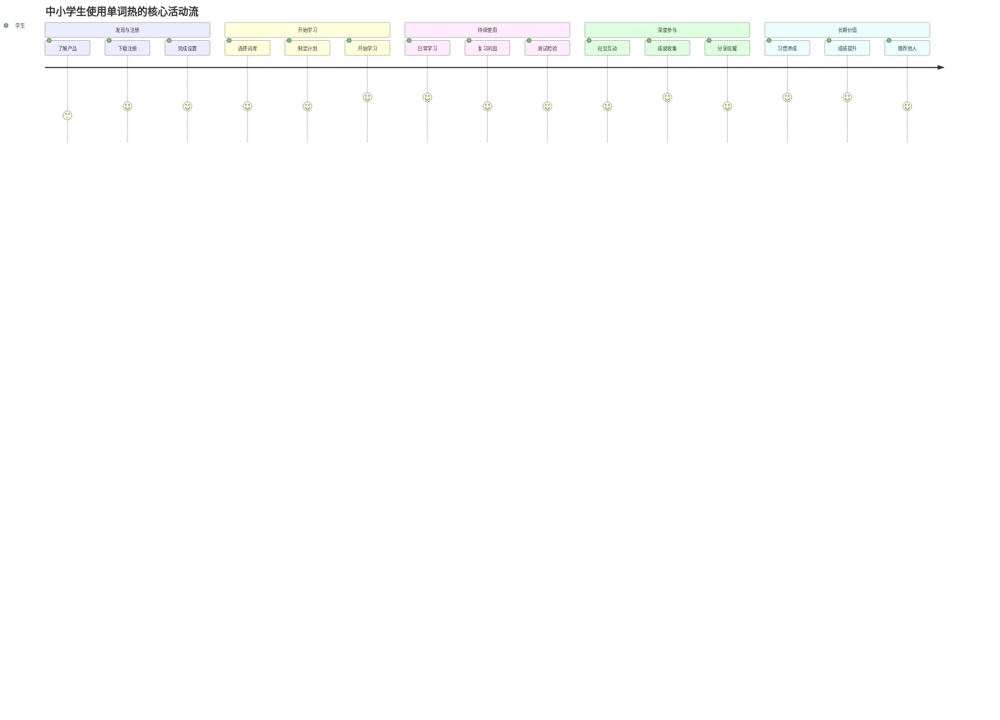
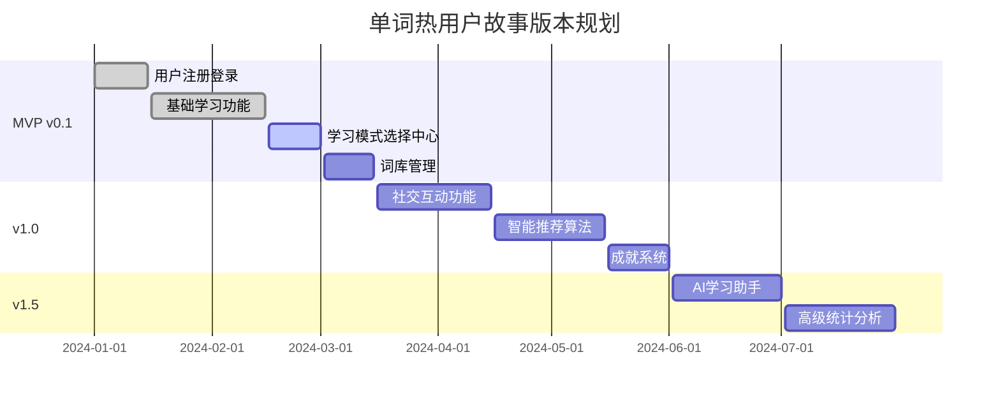
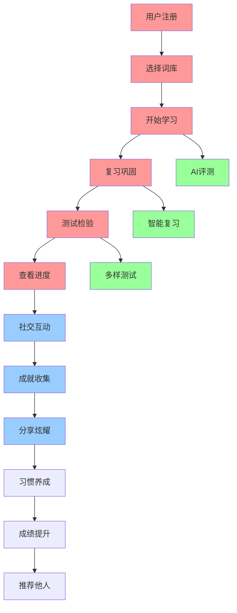

# 单词热 - 用户故事地图 (User Story Map)

## 1. 用户故事地图概述

### 1.1 文档目的
本文档通过用户故事地图的形式，系统性地描述中小学生使用"单词热"产品的完整用户旅程，帮助产品团队理解用户需求的优先级和版本规划的合理性。

### 1.2 用户故事地图结构说明
- **横向（用户活动流）**：描述用户使用产品的主要活动序列
- **纵向（任务分解）**：将每个活动分解为具体的用户任务和故事
- **优先级层次**：按照重要性和紧急性分为不同的发布版本

### 1.3 主要用户角色
- **主要用户**：中小学生（6-18岁）
- **次要用户**：家长（25-45岁）
- **潜在用户**：教师（25-50岁）

## 2. 用户活动流 (横向)

### 2.1 核心用户活动序列

### 2.2 用户活动阶段定义

**阶段1：发现与注册**
- 用户首次接触产品
- 完成注册和基础设置
- 了解产品核心价值

**阶段2：开始学习**
- 选择适合的学习内容
- 制定个人学习计划
- 体验核心学习功能

**阶段3：持续使用**
- 建立日常学习习惯
- 通过复习巩固记忆
- 定期进行自我检测

**阶段4：深度参与**
- 参与社交互动功能
- 收集成就和徽章
- 分享学习成果

**阶段5：长期价值**
- 形成稳定学习习惯
- 实现学习目标
- 成为产品推广者

## 3. 用户任务分解 (纵向)

### 3.1 发现与注册阶段

#### 3.1.1 了解产品
**MVP版本 (v0.1)**
- 作为一名中小学生，我想要快速了解这个app能帮我做什么，以便决定是否值得尝试
- 作为一名家长，我想要了解这个产品的教育价值和安全性，以便决定是否让孩子使用

**v1.0版本**
- 作为一名学生，我想要看到其他同学的使用效果，以便增强使用信心
- 作为一名家长，我想要了解产品的收费模式，以便做出消费决策

#### 3.1.2 下载注册
**MVP版本 (v0.1)**
- 作为一名学生，我想要通过微信快速注册，以便不用记住额外的账号密码
- 作为一名用户，我想要注册过程简单快捷，以便快速开始使用

**v1.0版本**
- 作为一名家长，我想要为孩子创建账号并设置监督权限，以便管理孩子的学习
- 作为一名用户，我想要导入已有的学习数据，以便继续之前的学习进度

#### 3.1.3 完成设置
**MVP版本 (v0.1)**
- 作为一名学生，我想要选择我的年级和学习目标，以便获得个性化的学习内容
- 作为一名用户，我想要设置学习提醒时间，以便养成规律的学习习惯

**v1.0版本**
- 作为一名学生，我想要选择我使用的教材版本，以便学习与课堂同步的词汇
- 作为一名用户，我想要个性化界面主题，以便获得更好的使用体验

### 3.2 开始学习阶段

#### 3.2.1 选择词库
**MVP版本 (v0.1)**
- 作为一名小学生，我想要选择适合我年级的基础词汇，以便从简单开始学习
- 作为一名中学生，我想要选择考试相关的词汇，以便提高考试成绩

**v1.0版本**
- 作为一名学生，我想要选择与我教材同步的词库，以便配合课堂学习
- 作为一名学生，我想要根据兴趣选择主题词汇（如动物、运动），以便提高学习兴趣

**v1.5版本**
- 作为一名学生，我想要系统推荐适合我水平的词库，以便获得最佳学习效果
- 作为一名学生，我想要创建自己的专属词库，以便学习特定的词汇

#### 3.2.2 学习模式选择
**MVP版本 (v0.1)**
- 作为一名学生，我想要在统一的页面中看到所有学习模式，以便根据我的需求选择合适的学习方式
- 作为一名用户，我想要了解每种学习模式的特点和适用场景，以便做出最佳选择
- 作为一名学生，我想要快速继续上次的学习，以便保持学习的连续性

**v1.0版本**
- 作为一名学生，我想要根据我的学习偏好自定义学习模式组合，以便获得最佳的学习效果
- 作为一名用户，我想要看到各模式的掌握率统计，以便了解我的学习强弱项

#### 3.2.3 学习设置配置
**MVP版本 (v0.1)**
- 作为一名学生，我想要设置每次学习的单词数量，以便控制学习强度
- 作为一名用户，我想要调整发音语速，以便适应我的听力水平
- 作为一名学生，我想要开启自动播放发音，以便加强听力记忆

**v1.0版本**
- 作为一名用户，我想要设置学习提醒和目标，以便保持学习动力
- 作为一名学生，我想要选择学习时的背景音乐，以便营造更好的学习氛围

#### 3.2.4 制定计划
**MVP版本 (v0.1)**
- 作为一名学生，我想要设置每天学习的单词数量，以便控制学习强度
- 作为一名学生，我想要看到完成计划需要的时间，以便合理安排学习

**v1.0版本**
- 作为一名学生，我想要系统根据我的时间安排智能制定学习计划，以便更科学地学习
- 作为一名家长，我想要参与制定孩子的学习计划，以便监督学习进度

**v1.5版本**
- 作为一名学生，我想要根据考试时间制定冲刺计划，以便在考试前掌握重点词汇
- 作为一名学生，我想要调整学习计划的难度和节奏，以便适应我的学习能力

#### 3.2.3 开始学习
**MVP版本 (v0.1)**
- 作为一名学生，我想要通过有趣的游戏角色来记忆单词，以便更容易记住
- 作为一名学生，我想要听到标准的单词发音，以便学会正确读音

**v1.0版本**
- 作为一名学生，我想要看到单词的多种释义和例句，以便全面理解单词含义
- 作为一名学生，我想要通过动画和互动来加深记忆，以便提高学习效果

**v1.5版本**
- 作为一名学生，我想要根据我的记忆特点选择不同的学习模式，以便找到最适合的方法
- 作为一名学生，我想要在学习过程中获得即时反馈，以便及时调整学习策略

### 3.3 持续使用阶段

#### 3.3.1 日常学习
**MVP版本 (v0.1)**
- 作为一名学生，我想要每天按计划学习新单词，以便稳步提升词汇量
- 作为一名学生，我想要看到我的学习进度，以便了解自己的成长

**v1.0版本**
- 作为一名学生，我想要在碎片时间快速学习，以便充分利用时间
- 作为一名学生，我想要系统记录我的学习历史，以便回顾学习轨迹

**v1.5版本**
- 作为一名学生，我想要根据我的学习状态调整每日任务，以便保持最佳学习效果
- 作为一名学生，我想要与朋友一起学习，以便互相激励

#### 3.3.2 复习巩固
**MVP版本 (v0.1)**
- 作为一名学生，我想要系统提醒我复习之前学过的单词，以便防止遗忘
- 作为一名学生，我想要重点复习我不熟悉的单词，以便提高掌握程度

**v1.0版本**
- 作为一名学生，我想要通过科学的复习算法安排复习时间，以便最大化记忆效果
- 作为一名学生，我想要在复习中看到我的记忆强度变化，以便了解掌握情况

**v1.5版本**
- 作为一名学生，我想要智能复习系统根据我的遗忘规律安排复习，以便个性化学习
- 作为一名学生，我想要通过错词本集中复习薄弱环节，以便快速提升

#### 3.3.3 测试检验
**MVP版本 (v0.1)**
- 作为一名学生，我想要通过选择题测试我的学习效果，以便了解掌握程度
- 作为一名学生，我想要看到测试结果和错误分析，以便知道需要改进的地方

**v1.0版本**
- 作为一名学生，我想要通过多种题型全面测试我的能力，以便检验不同维度的掌握情况
- 作为一名学生，我想要参加定期的阶段性测试，以便评估学习成果

**v1.5版本**
- 作为一名学生，我想要通过AI评测我的发音，以便提高口语能力
- 作为一名学生，我想要参加模拟考试，以便为真实考试做准备

### 3.4 深度参与阶段

#### 3.4.1 社交互动
**v1.0版本**
- 作为一名学生，我想要添加同学为好友，以便一起学习和比较进度
- 作为一名学生，我想要看到排行榜上的排名，以便激励自己更努力学习

**v1.5版本**
- 作为一名学生，我想要加入学习小组，以便与志同道合的同学一起进步
- 作为一名学生，我想要参与每日挑战活动，以便在竞争中提升自己

**v2.0版本**
- 作为一名学生，我想要参加全国性的学习竞赛，以便展示我的学习成果
- 作为一名学生，我想要成为学习导师帮助其他同学，以便在教学中巩固知识

#### 3.4.2 成就收集
**v1.0版本**
- 作为一名学生，我想要获得学习成就徽章，以便记录我的学习里程碑
- 作为一名学生，我想要看到我的等级和经验值，以便感受成长的乐趣

**v1.5版本**
- 作为一名学生，我想要收集稀有的成就徽章，以便展示我的特殊成就
- 作为一名学生，我想要通过完成挑战解锁新的角色和道具，以便增加学习乐趣

**v2.0版本**
- 作为一名学生，我想要获得官方认证的学习证书，以便证明我的学习成果
- 作为一名学生，我想要参与角色养成游戏，以便在游戏中持续学习

#### 3.4.3 分享炫耀
**v1.0版本**
- 作为一名学生，我想要分享我的学习成果到朋友圈，以便获得认可和鼓励
- 作为一名学生，我想要展示我的成就徽章，以便让朋友看到我的努力

**v1.5版本**
- 作为一名学生，我想要制作个性化的学习报告分享，以便展示我的学习历程
- 作为一名学生，我想要邀请朋友一起使用这个产品，以便一起进步

**v2.0版本**
- 作为一名学生，我想要创建学习视频分享我的经验，以便帮助其他同学
- 作为一名学生，我想要参与产品的推广活动，以便获得奖励和认可

### 3.5 长期价值阶段

#### 3.5.1 习惯养成
**v1.0版本**
- 作为一名学生，我想要通过连续学习天数的记录，以便养成每日学习的习惯
- 作为一名家长，我想要看到孩子学习习惯的养成过程，以便给予适当的鼓励

**v1.5版本**
- 作为一名学生，我想要通过数据分析了解我的学习规律，以便优化学习习惯
- 作为一名学生，我想要设置学习目标并跟踪完成情况，以便保持学习动力

**v2.0版本**
- 作为一名学生，我想要通过AI助手提醒和指导，以便维持良好的学习习惯
- 作为一名学生，我想要将学习习惯扩展到其他学科，以便全面提升学习能力

#### 3.5.2 成绩提升
**v1.0版本**
- 作为一名学生，我想要看到我的词汇量增长曲线，以便了解学习效果
- 作为一名家长，我想要看到孩子的学习报告，以便了解学习成果

**v1.5版本**
- 作为一名学生，我想要通过模拟测试预测我的考试成绩，以便做好考试准备
- 作为一名学生，我想要看到我在班级中的学习排名，以便了解相对水平

**v2.0版本**
- 作为一名学生，我想要获得个性化的学习建议，以便进一步提升成绩
- 作为一名教师，我想要看到学生的整体学习情况，以便调整教学策略

#### 3.5.3 推荐他人
**v1.0版本**
- 作为一名满意的用户，我想要推荐给我的同学朋友，以便他们也能受益
- 作为一名家长，我想要推荐给其他家长，以便分享好的教育资源

**v1.5版本**
- 作为一名用户，我想要通过推荐获得奖励，以便在帮助他人的同时获得回报
- 作为一名用户，我想要参与口碑传播活动，以便支持产品发展

**v2.0版本**
- 作为一名忠实用户，我想要成为产品大使，以便在更大范围内推广产品
- 作为一名用户，我想要参与产品改进建议，以便让产品变得更好

### 3.6 底部菜单栏（tabBar）统一规范

为保持跨版本与原型的一致性，底部菜单栏统一为 4 栏：
- 首页（Home）
- 学习（Learning）
- 词库（Word Library）
- 我的（Profile）

约定：
- 非菜单栏页面（练习中心、拼写、听写、选择题、设置、订阅等）通过页面按钮或链接跳转（wx.navigateTo），不进入菜单栏。
- 菜单栏页面之间使用 wx.switchTab 切换；返回使用 wx.navigateBack 或页面内返回。
- USM 中涉及导航的用户故事应遵循上述结构，对被取消的菜单项标注为“链接跳转”。

## 4. 故事优先级与版本映射 (关联 Roadmap 版本)

### 4.1 版本规划概览

### 4.2 MVP版本 (v0.1) - 核心学习体验

**P0 优先级（必须有）**：
- ✅ 用户注册和基础设置
- ✅ 词库选择和预览
- 🔄 **学习模式选择中心**（当前开发中）
  - 统一的学习模式选择界面
  - 继续学习功能
  - 基础学习设置配置
- 📋 基础学习功能（卡片模式、选择题模式）
- 📋 学习进度跟踪

**P1 优先级（应该有）**：
- 📋 错题本功能
- 📋 基础复习提醒
- 📋 学习统计展示

**用户价值验证目标**：
- 验证游戏化学习是否能提高学习兴趣
- 验证记忆算法是否能提升学习效果
- 验证产品是否能满足基本学习需求

### 4.3 v1.0版本 - 完整学习生态

**P0 优先级（必须有）**：
- 📋 多种学习模式（拼写、听写、智能混合）
- 📋 学习模式个性化配置
- 📋 智能复习算法
- 📋 社交功能基础版

**P1 优先级（应该有）**：
- 📋 成就徽章系统
- 📋 好友排行榜
- 📋 学习数据分析

**新增用户故事（P0）**：
- 完整词库系统和教材同步
- 高级记忆算法和个性化复习
- 多样化测试模式
- 社交功能（好友、排行榜）
- 成就系统和徽章收集
- 家长监督和学习报告
- 会员订阅和付费功能

**新增用户故事（P1）**：
- 学习数据可视化
- 个性化界面主题
- 离线学习支持
- 分享功能

### 4.4 v1.5版本 - AI增强体验

**P0 优先级（必须有）**：
- 📋 AI学习助手
- 📋 个性化学习路径
- 📋 高级数据分析

**P1 优先级（应该有）**：
- 📋 语音识别评测
- 📋 学习效果预测
- 📋 家长监督功能

**新增用户故事（P0）**：
- AI语音评测功能
- 智能学习路径推荐
- 错词本智能复习
- 学习小组和挑战活动

**新增用户故事（P1）**：
- 单词拍照识别
- 个性化学习报告
- 高级成就系统
- 学习竞赛功能

### 4.5 功能优先级矩阵

| 功能模块 | 用户价值 | 技术复杂度 | 版本规划 | 优先级 |
|---------|---------|-----------|---------|--------|
| 学习模式选择中心 | 高 | 低 | MVP v0.1 | P0 |
| 基础学习功能 | 高 | 中 | MVP v0.1 | P0 |
| 词库管理 | 高 | 低 | MVP v0.1 | P0 |
| 学习进度跟踪 | 中 | 低 | MVP v0.1 | P1 |
| 智能复习算法 | 高 | 高 | v1.0 | P0 |
| 社交互动功能 | 中 | 中 | v1.0 | P1 |
| AI学习助手 | 高 | 高 | v1.5 | P0 |
| 家长监督功能 | 中 | 中 | v1.5 | P1 |

### 4.6 v2.0版本 - 平台扩展

**新增用户故事（P0）**：
- 多平台数据同步
- 跨设备学习体验
- 教师端管理功能
- 班级管理系统

**新增用户故事（P1）**：
- VR/AR学习体验
- 多语言支持
- 学习视频创作
- 产品推广大使

### 4.7 版本间用户故事依赖关系

**图例说明**：
- 🔴 红色：MVP版本核心功能
- 🔵 蓝色：v1.0版本社交功能
- 🟢 绿色：v1.5版本AI功能

## 5. 用户故事验收标准

### 5.1 故事完成定义(Definition of Done)

每个用户故事必须满足以下标准才能被认为完成：

**功能标准**：
- ✅ 功能按照故事描述正确实现
- ✅ 通过所有相关的测试用例
- ✅ 用户界面符合设计规范
- ✅ 性能满足非功能需求

**质量标准**：
- ✅ 代码通过代码审查
- ✅ 无严重和高优先级缺陷
- ✅ 用户体验测试通过
- ✅ 文档更新完成

**验收标准**：
- ✅ 产品经理验收通过
- ✅ 用户测试反馈积极
- ✅ 数据埋点正确实施
- ✅ 上线准备工作完成

### 5.2 关键用户故事的详细验收标准

**游戏化单词学习**：
- 每个单词都有对应的游戏角色
- 角色动画播放流畅（>30fps）
- 用户能理解角色与单词的关联（理解率>90%）
- 学习过程有趣味性（满意度>4.0分）

**智能记忆算法**：
- 复习推荐准确率>85%
- 用户记忆保持率提升>30%
- 复习提醒及时准确（误差<5分钟）
- 算法能根据用户反馈自动调整

**社交互动功能**：
- 好友添加和管理功能正常
- 排行榜数据实时更新（延迟<1分钟）
- 成就徽章正确解锁和显示
- 分享功能成功率>95%

## 6. 用户反馈收集计划

### 6.1 反馈收集方法

**定量反馈**：
- 用户行为数据分析
- A/B测试结果对比
- 关键指标监控
- 用户满意度调研

**定性反馈**：
- 用户访谈和焦点小组
- 应用商店评价分析
- 客服反馈汇总
- 社交媒体监听

### 6.2 反馈应用机制

**快速响应**：
- 严重问题24小时内响应
- 用户建议1周内评估
- 功能优化2周内实施
- 重大改进1个月内上线

**持续优化**：
- 月度用户故事优先级调整
- 季度产品路线图更新
- 半年度用户需求重新评估
- 年度产品战略调整

## 7. 高保真原型交互映射（关联 PRD 6.7）

### 7.1 阶段→页面→交互要点映射

- 发现与注册 → 首页（Home）：
  - 显示学习概览与推荐词库；主色 CTA 一键继续学习（参见 `docs/PRD.md` 6.7.3 首页规范）
- 开始学习 → 学习模式选择：
  - 模式卡两列网格、折叠设置、底部固定继续学习（参见 `docs/PRD.md` 6.7.3 学习模式选择）
- 持续使用 → 卡片学习（图像记忆）：
  - 角色动画区、认识/不认识/加强记忆 segmented 控件、正确/错误反馈动效（参见 `docs/PRD.md` 6.7.3 卡片学习）
- 持续使用 → 复习巩固/测试检验：
  - 选择题即时反馈与解析上滑、计时器与暂停确认（参见 `docs/PRD.md` 6.7.3 选择题测试）
- 深度参与 → 成就与排行榜：
  - 徽章锁定/解锁视觉态、周/月榜切换（参见 `docs/PRD.md` 6.7.3 我的/成就与排行榜）
- 长期价值 → 家长监督面板：
  - 趋势图与控制项、学习报告视图（参见 `docs/PRD.md` 6.7.3 家长监督面板）

### 7.2 动效与可用性原则对齐

- 动效统一：进入/退出 240ms，按钮 100ms，列表刷新 300ms（参见 `docs/PRD.md` 6.7.4）
- 可用性与无障碍：对比度、触达面积、焦点可见性（参见 `docs/PRD.md` 6.7.5）

### 7.3 骨架加载与弱网降级映射

- 首页与模式选择：骨架卡加载；弱网保留基本统计与按钮
- 卡片学习：动画占位 Skeleton，降级到文本+发音
- 测试页：题干与选项骨架，占位图/音频重试入口

### 7.4 验收路径（DoD → 交互原型）

- 游戏化单词学习：角色动画流畅、关联理解率与满意度指标在原型走查验证
- 智能记忆算法：复习提醒与推荐交互路径在模式选择与卡片学习中串联
- 社交互动：排行榜数据刷新动效与徽章解锁反馈按动效规范检查

### 7.5 原型交付结构对齐

- Figma Pages 与组件变体属性遵循 `docs/PRD.md` 6.7.7
- 资源命名与切片导出遵循 `docs/PRD.md` 6.7.6
- 关键页面连接热区按 USM 活动流分段组织（发现→开始→持续→深度→长期）

---

**文档状态**：已完成  
**最后更新**：2025-01-27  
**下一步行动**：创建产品评估指标框架，建立成功衡量标准
